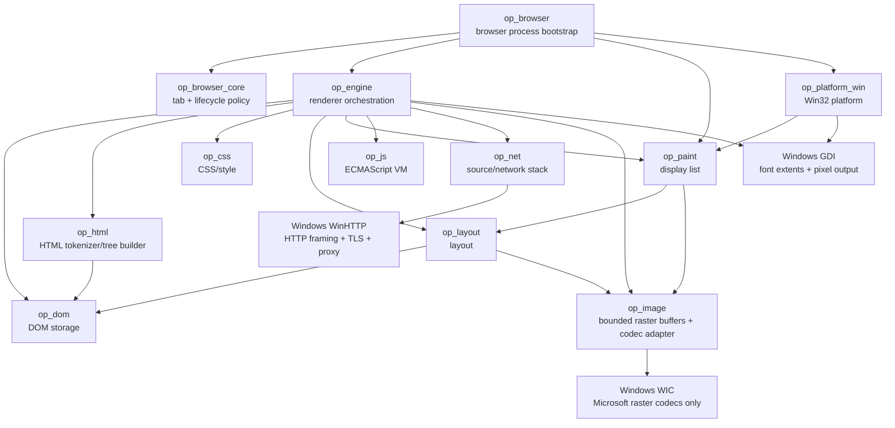

# OPBrowser Code Graph

Last updated: 2026-10-10

This document is the maintained human-readable code/dependency graph. It is updated
whenever crates, important types, or ownership boundaries change.

**Connected Code Graph:** [GENERATED_CODE_GRAPH.md](GENERATED_CODE_GRAPH.md)
is rebuilt directly from Cargo manifests by
`python tools/code_intelligence.py --write`. The `--check` variant is
enforced in Windows CI and fails when manifest-derived edges or Wiki
references change without committed updates. This maintained document
includes platform/native flow and ownership details that Cargo cannot infer;
the generated graph describes **crate-level edges only**, not a call graph.
See [Code Slicer](GENERATED_CODE_SLICES.md) for curated source-backed
functional paths. The 8 October baseline contains 12 crates and 22
local dependency edges.

## M4.31: stable EventTarget listener IDs and property-slot chronology

The owned op_js::JsRuntime now numbers registrations through
next_listener_registration_id and version_listener_options.
Element dom_listener_options and document/window/AbortSignal
lifecycle_listener_options retain a registration ID alongside
once/passive/signal. deliver_element_listeners and
deliver_lifecycle_listeners snapshot both the callback and the ID,
then recheck the live option map before dispatch: removing and
re-adding the same function cannot activate an obsolete snapshot.

dom_onclick_registration and lifecycle_property_registration
track property handlers separately. Target-phase callbacks now use
one registration-ordered stream for onclick plus Element callbacks
or onreadystatechange/onload/onabort plus global callbacks.
stopImmediatePropagation and callback exception isolation are shared
with the existing native EventTarget delivery. The click property's
registration ID remaps with synthetic-to-native op_dom node identity.
Engine mutation replay and original op_layout/op_paint remain unchanged.
No dependencies or external JS engines added.

## M4.30b-d: DOMException -> AbortSignal composition -> fetch completion

op_js::JsRuntime::new_dom_exception creates branded original
DOMException objects on their dedicated prototype (name/message,
legacy code and toString). AbortController default reasons and
AbortSignal.timeout deadlines use AbortError and TimeoutError.

JsRuntime's PendingAbortDeadline records a signal ObjectId and
Instant; next_timer_wait and run_due_timers integrate deadlines
with existing original TimerReport and microtask checkpoints.
abort_followers tracks the directed AbortSignal.any cascade,
bounded by source/input and follower counts. abort_signal marks
state before delivering the event, clears deadline state, removes
EventTarget registrations, revokes queued request callbacks and
propagates reason identity to dependent signals.

The self-hosted crates/op_js/src/async_fetch.js Request/Fetch facade
stores Request.signal and passes a native ObjectId to opFetchText.
The original runtime's text_request_signals associates fetch task
IDs with signals, while the existing network manager
op_engine::Engine::dispatch_text_requests still owns same-origin
worker requests. Upon abort the Promise rejects from the signal's
abort event and outstanding callbacks/queued requests are removed;
in-flight WinHTTP calls may still finish but late results are ignored
by complete_text_response_request. No crate/foreign JS dependency
was added and the rest of the DOM -> paint path is unchanged.

## M4.30a: bounded original AbortController/AbortSignal flow

op_js owns new ObjectKind::AbortController and AbortSignal and
BuiltinFunction handlers for their constructors, abort operation,
static signal factory and throwIfAborted(). JsRuntime::new_abort_signal
builds the native signal event target. DomListenerOptions now carries
an optional AbortSignal ObjectId in both Element and Document/Window
listener maps. AbortController.abort marks signal state, synchronously
calls remove_aborted_signal_listeners across both maps, then uses
dispatch_abort_signal_event and the existing lifecycle EventTarget
delivery and exception isolation. Existing native click/path dispatch
checks live registrations before invoking each callback, so abort
during dispatch suppresses later queued callbacks. op_engine/DOM/
layout/op_paint flow remains unchanged. No third-party engine or new
crate dependency.

## M4.29b: connected Element event path and native hit testing

op_engine::scripts::sync_dom_tree publishes the real document-root
NodeId to op_js::JsRuntime before parser scripts and later resyncs.
The original JS runtime's dom_document_root is reset with navigation,
and element_event_path stops at the non-Element parser root.
path_reaches_document gates delivery to attached Document/Window.
dispatch_custom_event_inner and dispatch_dom_click_path now use
deliver_element_global_capture/bubble around existing Element
capture/target/bubble. The native op_engine::scripts::dispatch_click
prefilter calls has_dom_click_path_listener to detect global-only
handlers. Synthetic click, page event dispatch, host native clicks,
op_dom mutation replay, layout and op_paint remain owned components.
Detached/removal behavior is covered by VM tests. No new dependencies.

## M4.29a: Document/Window EventTarget and lifecycle dispatch

The original op_js now stores lifecycle_listener_options per
(receiver ObjectId, event type, capture, callback ObjectId).
deliver_lifecycle_listeners uses once removal before callback invocation,
passive-state management and the existing call_isolated_event_handler
exception boundary. deliver_lifecycle_target preserves target
capture/normal ordering, property callbacks and immediate-stop checks.
dispatch_lifecycle_event retains host-owned document.readyState and
the existing document-targeted load event compatibility behavior.
The new dispatch_global_custom_event routes document-targeted
custom Events through window capture, document target and optional
window bubble, with bounded recursion and event cleanup.
op_engine still replays resulting DOM changes through op_dom,
layout and op_paint to native pixels; no new crate dependencies.

## M4.28b: listener metadata, exception boundary and native paint

op_js owns listener metadata keyed by DOM node/type/capture/function.
The original VM reads once/passive/capture dictionaries and keeps its
existing per-event callback maps. deliver_element_listeners merges
native click and custom DOM Event delivery, removes once registrations
before nested calls, suppresses passive cancelation, and isolates
ordinary handler exceptions into bounded runtime diagnostics. Synthetic
node IDs remap listener metadata to physical op_dom IDs after replay.
op_engine exposes Engine.active_event_listener_errors and preserves
DOM mutation -> layout -> op_paint rendering on successful handlers.
No new dependencies or foreign JS engines were added.

## M4.28a: immediate-stop event control

In op_js, EventStopImmediatePropagation marks the event's immediate-stop and path-stop flags; dispatch_dom_click_path and dispatch_custom_event_inner check after each callback. The custom event path resets its immediate-stop state for reuse. Engine script mutation replay through op_dom, layout and op_paint remains unchanged. VM and cross-crate native paint tests verify the flow. No new crate dependencies.

## M4.27: selector chains and original typed DOM events to native pixels

Original op_js now matches bounded compound selector tokens
through descendant/child ancestor chains against the live
parent/child/attribute snapshot. Document/Element querySelector,
querySelectorAll, Element.matches and closest share this
matcher; static NodeLists keep their snapshot and identity.

Original typed DOM event listener maps now carry event type
and capture mode, alongside the existing original click tables.
Event constructor, Element.dispatchEvent and legacy Event
initialization execute callback chains through capture/target/
bubble. The return boolean reflects cancelation, with guarded
reentry/depth. Event-driven DOM mutations are replayed by
op_engine::scripts into authoritative op_dom then laid out/
painted by original CSS/layout/op_paint. Seven end-to-end
tests assert updated native text output.

Pinned original WPT DOM/Events v5 includes the untouched
EventTarget-dispatchEvent-returnvalue.html (two tests).
Twelve manually chosen original HTML source files pass;
three files explicitly skipped. No representative WPT
compatibility can be inferred from this sample.

## M4.26: JS in, scoped query selectors, programmatic click and WPT DOM v4

op_js lexer and parser now recognize relational in. The original
VM performs bounded HasProperty checks, including live DOM
accessor names, and forwards querySelector/querySelectorAll
requests through its authoritative staged parent/child/attribute
tree. A new static query-result NodeList differs from retained
live HTMLCollection/tag lists; saved handles survive binding
virtual DOM IDs to physical native op_dom NodeIds.

element.click calls the existing native DOM event propagation
path (capture/target/bubble, bounded nested dispatch), then
op_engine replays resulting DOM mutations and rebuilds
CSS/layout/op_paint output. Five cross-crate tests verify
real text pixels and mutation behavior.

Pinned original-source WPT DOM smoke v4 adds a fixture using
JS in, keeping the existing synchronous testharness shim and
fail-sticky callback count. Fourteen files manually selected:
11 executed/passing, 3 skips. Not broad WPT conformance.

## M4.25: live tag-name search plus hardened WPT multi-case runner

Original op_js now implements Document/Element.getElementsByTagName,
Element.hasAttribute and hasAttributes. Live tag collections query
the current bounded element tree with descendant-only traversal;
parser snapshots and later DOM operations/timers feed the same
authoritative state. Script DOM changes recascade and paint
through op_engine and op_paint as before.

op_engine wpt_dom_probe reads the pinned upstream original source
and executes each original synchronous test body. The shim
counts callbacks, stores failures persistently, and verifies the
manifest's exact per-file test count and native PASS marker.
Ten original WPT DOM files pass, three explicitly unsupported
files remain SKIP. Two additional harness unit tests demonstrate
sticky-failure behavior. No official WPT conformance claim.

## M4.24: live Element children and pinned WPT DOM multi-fixture probe

The original JS VM computes childElementCount, firstElementChild,
lastElementChild and previous/nextElementSibling from live child
linkage and DOM element tags. Element.children retains the same
HTMLCollection object across mutation and synthetic-to-physical
binding, with basic item and namedItem resolution.

The pinned WPT DOM probe now reads seven upstream original
source files, runs their unchanged synchronous test bodies
with a narrow testharness substitute, and checks a native
paint-visible PASS marker. Three selected fixtures remain SKIP.
The sample is not representative WPT conformance.

## M4.23: Node connectivity and original WPT source to native pixels

op_js::JsRuntime derives Node siblings, isConnected,
ownerDocument, nodeName/tagName and Element.contains from the
bounded live parent/children model synchronized by op_engine.
classList mutations are validated before any write and support
multiple tokens. The original style declaration scanner keeps
semicolon-containing CSS values intact inside quotes/parentheses.

A new op_engine wpt_dom_probe reads an original file from a
pinned external WPT Git revision; replaces only harness imports
with minimal synchronous assert_equals/test support, executes
unchanged assertions in the original JS VM and checks the
native display-list result. A separate frozen manifest lists
explicitly unsupported DOM fixtures. No broad WPT pass rate
is asserted. See docs/COMPATIBILITY.md for limitations.

## M4.22: live JS NodeList/DOMTokenList/style to physical tree and pixels

The original JS runtime builds stable per-node live childNodes,
classList and style objects plus parentNode and first/last child
property access; NodeList length, item and index read the current
staged tree rather than a frozen snapshot. Element.replaceChild
and remove are queued as ordered op_js DomOperation records.

op_engine::scripts syncs child arrays, physical Text nodes and
attributes from the op_dom authoritative tree. Native
op_dom::replace_child validates ownership/ancestor constraints.
When virtual JS handles become physical NodeIds, cached
childNodes/classList/style objects and JS element identity survive.
Style/class changes flow through original CSS matching, computed
layout and op_paint. Nine integration tests verify resulting pixels
even after native timer callbacks. No external DOM or JS engine.

## M4.21: reparenting and Text creation -> host DOM -> CSS -> pixels

Original JS creates real Text nodes and stages removeChild,
insertBefore, setAttribute and removeAttribute in a bounded
DomOperation queue. It tracks existing parser-owned node attributes
and parent relationships and updates nested ID lookup immediately.
op_engine::scripts::apply_dom_operations validates and commits on
op_dom::Document; the engine refreshes author style matching and
computed styles using cached linked CSS/color profiles, then
native layout and paint. Nine integration cases verify pixel changes.

## M4.20: DOM VM op queue -> real DOM nodes -> recomputed native pixels

op_js::JsRuntime now owns bounded synthetic DOM node handles,
persistent JS object identity, detached parent relationships and
ordered DomOperation records. document.createElement constructs a
detached node; appendChild, id and textContent produce real host
operations with synthetic-to-physical node binding. document.body is
exposed when the HTML tree-builder has instantiated it.

op_engine::scripts::apply_dom_operations is the sole host replay
function: it allocates op_dom::Document nodes, updates attributes and
text, appends/reparents attached nodes and tracks actual mutations.
Parser script runner, retained click dispatch and Engine::tick_timers
all call the same ordered operation replay. Engine recomputes styles,
layout and native display list after changes. op_dom::Document
refuses ancestor cycles before changing parentage.
Integration tests verify dynamic identity, nested DOM, timer, click,
pixel output and cycle safety. General DOM methods remain absent.

## M4.19: native String/Array methods -> JS script -> DOM repaint

JsRuntime::install_standard_primitives owns Array.push/pop and the
String.charAt method, and a dedicated SyntaxError constructor/prototype
used by JSON.parse. The op_engine integration test confirms results
update existing textContent and render to native pixels. No foreign JS
engine or fake dynamic DOM nodes are used.

## M4.18: Test262 broader fixture -> own syntax VM -> native pixels

The pinned runtime v2 manifest is generated deterministically from
25 named upstream language/builtin feature groups via the source-only
build_test262_runtime_v2.py selector. The existing Test262 runtime
probe evaluates each case on a fresh original JS runtime, now using
correct multiline include/flag metadata and version-specific JSON.
tools/compatibility.ps1 reports runtime v1 and runtime v2 separately.

The lexer now tokenizes typeof and ?, the parser builds conditional
expressions, and bytecode emits lazy branching instructions or special
TypeofBinding for missing-name semantics. The runtime implements
typeof_value and native standard Array/Number/Object helper methods.
An op_engine integration test verifies these features mutate DOM and
paint native text pixels. It never embeds another browser/JS runtime.

## M4.17: object primitives -> runtime conversion -> Test262 verdict

A new boxed_values VM map holds primitive payloads separately from
ordinary JS properties. new Boolean/Number/String and Object(primitive)
create real object references tied to their constructor prototypes.
The bytecode binary instruction resolves ToPrimitive via valueOf then
toString, respecting own/inherited callable methods, user-thrown values,
the existing VM call-depth budget and object prototype walks.
instanceof instead searches the receiver's prototype chain with a
callable constructor and a validated constructor.prototype. Unary
void evaluates for side effects; non-strict undeclared assignments
create mutable global var bindings. Test262 Runtime v1 now passes
82/91 previously pinned cases versus 59/91 at M4.16.

## M4.16: pinned Test262 runtime probe -> original VM -> standard globals

The separate op_js bin/test262_runtime_probe evaluates each pinned
Test262 fixture against a fresh original JsRuntime after injecting a
small original-JS assertion/Test262Error bootstrap. Metadata-aware
skip reasons and expected runtime-negative exception types produce a
per-case JSON report plus an independent, scoped runtime percentage.
tools/compatibility.ps1 runs it separately from test262_probe and WPT.

JsRuntime::install_standard_primitives exposes Object, Array,
Boolean, Number, String, isNaN, isFinite, Number constants and
Infinity/NaN. JsValue::to_number parses 0x/0o/0b numeric strings.
The 91-case locked arithmetic/equality suite measures these changes
as 18->59 passes without hiding the remaining 32 failures. No
strict-mode/modern-ES coverage or complete boxed primitive semantics.

## M4.15: native JSON → original VM object → Promise → DOM repaint

op_js::json implements strict bounded parsing, independent of JS eval.
The runtime exposes native JsonParse and JsonStringify builtins, creates
owned arrays/objects with json_to_value and serializes with cycle
detection through json_from_value. The JSON global exists without DOM.

The self-hosted async_promise.js implements all/race/allSettled/any
over array-like input; Response.json uses Promise.resolve(body).then
to call native JSON.parse at a normal microtask checkpoint. Existing
Engine::dispatch_text_requests, Engine::tick_timers and
JsRuntime::complete_text_response_request preserve the safe network
boundary, followed by DOM changes and native pixels. No foreign engine.

## M4.14: Request/Headers → vetted GET → pre-connect redirect policy

The browser-context VM now installs a native Headers constructor with
owned HashMap-backed, budgeted get/has/set/append/delete and initializer
handling. A self-hosted Request wraps URL, GET method, Headers, same-origin
mode, credentials:omit and follow/error redirect policy. fetch(Request,
init) feeds these detached request options into opFetchText and
JsRuntime::take_text_requests, which preserves page generation identity.

Engine::dispatch_text_requests calls the new
NetworkContext::load_text_response_for_page_with_options. Both op_js and
op_net validate the allowlisted request header set. The WinHTTP loader
adds vetted fields via WinHttpAddRequestHeaders; only bounded,
same-origin GET network work runs off the page thread.

For ResourceKind::Text, WinHTTP auto-follow is disabled.
op_net::http::load_text_with_options resolves each Location and checks
same_origin before the next network connection, at most five hops;
redirect:error rejects the first redirect. Non-fetch loaders continue
with their prior redirect behavior. Response metadata and body then
return to the VM through the existing Promise/microtask/repaint path.

## M4.13: WinHTTP status and headers through owned Response and native pixels

The op_net HTTP text loader now retains status, reason phrase, final URL,
redirect flag and bounded headers in LoadedTextResponse; non-text loaders
still reject non-2xx. NetworkContext::load_text_response_for_page filters
and checks same-origin at the request and final-response boundaries.
Engine::dispatch_text_requests and Engine::tick_timers carry detached
metadata through the generation-tagged page completion channel.
JsRuntime::complete_text_response_request builds a TextResponse host
object with an ObjectKind::Headers value and native HeadersGet/HeadersHas
functions. Header names are normalized and Set-Cookie is excluded.
The self-hosted Response calculates ok from HTTP status, then schedules
Promise reactions using the already-owned microtask queue; DOM changes
flow to native repaint. Legacy opFetchText retains status-error callbacks.

## M4.12: self-hosted Promise → filtered fetch → native repaint

The original `op_js` VM bootstraps `async_promise.js`, implementing
Promise state/settlement and reaction dispatch in its own ECMAScript subset.
Reactions call the original `queueMicrotask` builtin and drain at retained
task checkpoints in `JsRuntime::drain_microtasks`. No foreign JS runtime
or second microtask queue is involved.

For page contexts, `JsRuntime::install_dom_snapshot` also loads
`async_fetch.js`: `fetch()` wraps `opFetchText` in a Promise and
`Response.text()` returns a second Promise. The existing
`JsRuntime::take_text_requests` → `Engine::dispatch_text_requests` →
`NetworkContext::load_text_for_page` → `Engine::tick_timers` →
`JsRuntime::complete_text_request` pipeline delivers a completion back
to the owning VM; Promise reactions then record `DomTextMutation`
and reuse CSS/layout/native paint. Page generations reject stale results.
This is not yet full HTTP Response semantics: synthetic 200/OK on
successful filtered text loads; failed HTTP status currently rejects.

## First live JS → DOM → repaint boundary (M4.1)

The `op_engine::scripts` preparation step traverses parsed HTML, collects
at most 16 bounded classic inline scripts and supplies
`op_js::JsRuntime::install_dom_snapshot` with detached element IDs and
textContent values. The VM's own builtin getElementById returns an element
object. Its textContent setter queues bounded `DomTextMutation` records;
it never borrows or holds a raw pointer to the live DOM. Between scripts,
`op_engine` applies queued records with `op_dom::Document::set_text_content`,
then continues normal author CSS collection/computation, layout and paint.
A `PreparedDocument` retains the mutated DOM so resize reflow remains
consistent. The runtime reports executed/failed/skipped/mutations rather
than aborting navigation for unsupported JavaScript.

This is not DOM scripting conformance or a complete script lifecycle:
external scripts, event loop, DOM mutation observers, document.write and
real parser-blocking timing remain absent.

## M4.2: filtered external JavaScript resource path

`op_engine::scripts::execute_for_page` now accepts the filtered
`NetworkContext` and document base. Its document-ordered script
sequence may contain inline source or an external URL. For external
sources, `op_net::resolve_script_source` rejects unsafe/cross-origin
references, then `NetworkContext::load_script_for_page` invokes
`ResourceType::Script` filtering. The resource decoder uses explicit
JavaScript MIME types, UTF-8/BOM decoding, bounded local file reads and
WinHTTP transport. Following a redirect, its final origin is checked
against the page before code execution.

The loaded code executes in the same bounded `JsRuntime` as adjacent
inline scripts; detached `DomTextMutation` records update retained
DOM, then CSS/layout/paint work exactly as in M4.1. Failed requests
do not abort subsequent scripts. Unsupported async/defer/integrity
external scripts are skipped; scheduling remains post-parse and
full browser document lifecycle is still absent.

## M4.3: click event → persistent VM → reflow

The per-page `PreparedDocument` retains an `Option<JsRuntime>`,
including closures registered by `addEventListener("click", fn)` or
the `onclick` property. `op_layout::flow` records block
`ClickRegion` rectangles for `id`-bearing elements, with relative
position offsets. `op_platform_win::NavigationEvent::Click` converts
client coordinates to document coordinates using toolbar height and
scroll offset; hyperlink actions retain priority. The browser worker
calls `op_engine::Engine::click_at`, which hit-tests the current layout,
dispatches to the registered JS callback, applies bounded detached
DOM text mutations, recomputes CSS when needed, and sends a non-navigation
reflow page back to the Win32 painter.

M4.4 extends this path: hit-testing selects the smallest id-bearing
block region even if only an ancestor registered a listener. The engine
follows `op_dom::Node::parent` and calls
`JsRuntime::dispatch_dom_click_path` for target-then-ancestor callbacks.
The retained VM exposes `event.target`, `event.currentTarget`,
`eventPhase`, and `event.bubbles`; `removeEventListener` removes
callbacks by function identity. Detached mutations still cross the
owned DOM and computed-style/reflow boundary. Capture, cancellation,
keyboard dispatch and a full hit-test tree are not yet implemented.

## Crate dependency graph



No browser engine or ready-made JavaScript engine is below this graph.

## Current key types

```mermaid
classDiagram
    class Engine {
        -EngineState state
        -NetworkContext network
        -NavigationState navigation
        -Option~String~ document_address
        -Option~PreparedDocument~ active_document
        +new()
        +start()
        +state()
        +navigation()
        +render_html()
        +set_html_page()
        +reflow()
        +render_source()
        +navigate()
        +follow_link()
        +go_back()
        +go_forward()
        +reload()
    }

    class NavigationState {
        -Vec~NavigationEntry~ entries
        -Option~usize~ current_index
        +entries()
        +current_index()
        +current()
        +can_go_back()
        +can_go_forward()
    }

    class PreparedDocument {
        address
        mime_type
        document
        images
        PageImages elements / generated
        stylesheet_addresses
        +render(width, height)
    }

    class NavigationEntry {
        +String request
        +String address
        +String mime_type
    }

    class RenderedPage {
        +String address
        +String mime_type
        +DisplayList display_list
    }

    class NetworkContext {
        -RequestFilter request_filter
        +request_filter()
        +request_filter_mut()
        +load_document(source) Result~LoadedDocument, LoadError~
        +load_stylesheet_for_page(source, top_level, limit)
        +load_image_for_page(source, top_level, limit)
    }

    class RequestFilter {
        +import_adblock_rules(text) FilterImportReport
        +check(url, resource_type, top_level) RequestDecision
        +allow_site(host)
        +stats() FilterStats
    }

    class TabManager {
        +open(address, activate) TabId
        +activate(id)
        +close(id)
        +automatic_discard_candidate() TabId
        +discard(id, reason, scroll_y)
        +finish_restore(id)
    }

    class JsRuntime {
        -heap JsObject[]
        -environments Environment[]
        -global_env EnvironmentId
        -object_prototype ObjectId
        -array_prototype ObjectId
        -error_prototype ObjectId
        -type_error_prototype ObjectId
        -reference_error_prototype ObjectId
        -global_object ObjectId
        -instruction_budget
        -object_budget
        -environment_budget
        -call_depth_budget
        +new()
        +with_instruction_budget(limit)
        +eval_script(source) JsValue
        +execute(compiled) JsValue
        +global(name) JsValue
        +get_property(target, key) JsValue
    }
    class Environment {
        parent EnvironmentId?
        kind Global / Function / Block
        bindings
    }
    class FunctionObject {
        implementation User / Builtin
    }
    class FunctionImplementation {
        User FunctionTemplate + EnvironmentId
        Builtin Error / TypeError / ReferenceError
    }
    class JsObject {
        properties
        prototype ObjectId?
        kind Ordinary / Array / Function
        function FunctionObject?
    }
    class ObjectId {
        opaque heap index
    }
    class CompiledScript {
        code Instruction[]
    }
    class FunctionTemplate {
        name
        params
        code Instruction[]
    }
    class TryTemplate {
        try_code Instruction[]
        catch_param
        catch_code Instruction[]?
        finally_code Instruction[]?
    }
    class RunOutcome {
        Complete / Returned / Thrown
        Break / Continue
    }
    class Instruction {
        Push / Load / Declare / Assign
        UpdateBinding / UpdateProperty
        CreateObject / CreateArray / CreateFunction
        GetProperty / SetProperty / Call / Construct
        Unary / Binary / Dup / Pop
        EnterScope / ExitScope / UnwindScopes
        Jump / JumpIfFalse / JumpIfTrue
        Try / Throw / BreakSignal / ContinueSignal
        Return / SetCompletion / Halt
    }

    class Encoding {
        Utf8
        Utf16Le
        Utf16Be
        Windows1251
        Windows1252
    }

    class LoadedDocument {
        +String address
        +String mime_type
        +String text
        +SourceKind source_kind
    }

    class NativeBrowserWindow {
        -HWND hwnd
        +create(title, display_list)
        +hwnd()
        +painted_once()
        +viewport_size()
        +submit_address()
        +present()
        +link_at_client_point()
        +click_first_link()
        +set_navigation_state()
        +set_status()
        +run_message_loop(on_event)
    }

    class NavigationEvent {
        Navigate(source)
        FollowLink(href)
        Back
        Forward
        Reload
        Poll
    }

    class HttpUrl {
        secure
        host
        port
        target
    }

    class Document
    class Tokenizer
    class Characters {
        first
        second
        +iter()
    }
    class NamedEntry {
        name_offset
        value_offset
        name_length
        value_length
        legacy
    }
    class CssToken {
        kind
        Url(value) / BadUrl
        start
        end
    }
    class Stylesheet {
        rules
    }
    class StyleRule {
        selectors
        declarations
    }
    class Selector {
        compounds
        combinators
        pseudo_element
        specificity
    }
    class AttributeSelector {
        name
        matcher
        value
        case_insensitive
    }
    class PseudoClass {
        root / first-child / last-child / only-child / empty / link
        first-of-type / last-of-type / only-of-type
    }
    class FunctionalSelector {
        is / where / not -> Selector[]
        nth-child / nth-last-child -> NthSelector
    }
    class NthSelector {
        expression(a,b)
        of Selector[]
        from_end
        same_type
    }
    class PseudoElement {
        Before
        After
    }
    class Declaration {
        name
        value
        important
    }
    class Specificity {
        ids
        classes
        types
    }
    class StyleMap {
        NodeId -> MatchedDeclaration[]
        (NodeId, PseudoElement) -> MatchedDeclaration[]
        +declarations_for(node)
        +declarations_for_pseudo(node,pseudo)
    }
    class MatchedDeclaration {
        style_node
        declaration
        specificity
        source_order
        source
        value_from_var
    }
    class StyleCollection {
        styles
        errors
    }
    class ComputedStyleMap {
        NodeId -> ComputedStyle
        (NodeId, PseudoElement) -> ComputedPseudoStyle
        NodeId -> CustomPropertyMap
        (NodeId, PseudoElement) -> CustomPropertyMap
        +style_for(node)
        +pseudo_style_for(node,pseudo)
        +custom_properties_for(node)
        +pseudo_custom_properties_for(node,pseudo)
    }
    class CustomPropertyMap {
        case_sensitive_name -> resolved TokenKind[]
    }
    class CustomDependencyGraph {
        sorted names
        directed edges including fallback references
        iterative finish order / reverse SCC traversal
        cyclic node mask
    }
    class ValueBudget {
        token count
        token storage bytes
        fallback depth
    }
    class ComputedPseudoStyle {
        style
        content
        items Text / Image(url,style_node)
        replaced_image sole parsed URL
        quotes
    }
    class ComputedQuotes {
        Auto / None / Pairs(open,close)
    }
    class GeneratedContext {
        counters
        quote_depth
        suppressed
    }
    class CounterContext {
        counter_name -> value_stack
        +reset(name,value)
        +set(name,value)
        +increment(name,amount)
        +current(name)
        +values(name)
    }
    class CounterOperation {
        name
        value
    }
    class Display {
        Inline / Block / FlowRoot
        Flex / InlineFlex
        Table roles / Contents / None
    }
    class ComputedStyle {
        display
        color
        font_size_px
        font_weight
        font_style
        line_height
        text_align
        white_space
        text_decoration_line
        letter_spacing_px
        word_spacing_px
        text_transform
        background_color
        margin_edges
        padding_edges
        border_edges
        width / min_width / max_width
        height / min_height / max_height
        box_sizing
    }
    class InlineBoxStyle {
        node_id
        pseudo_identity
        relative_position_marker
        local_visual_offset
        padding_edges
        background
        border_edges
    }
    class NamedColorEntry {
        u16 name offset
        u8 name length
        three RGB bytes
        six-byte record
    }
    class InlineBoxes {
        parent-linked arena nodes
        continuation links / split-fragment history
        cached cumulative edges and depth
        iterative stack transitions
        nearest positioned ancestor / visual offsets
    }
    class InlineFragment {
        node_id / direction
        border box / padding edge bounds
        persistent cross-run relative containing geometry
    }
    class DeferredInlinePositioned {
        element identity / style / display
        static x-y / hypothetical flow width
        inline ancestor identity
        fallback positioning context
    }
    class InlineStyle {
        typography
        optional box stack index
    }
    class EmptyInline {
        InlineStyle
        no glyph payload
    }
    class InlineAtomic {
        width / height / baseline
        nested decorations / text / images / order
    }
    class InlineImage {
        used width and height
        optional Arc RasterImage
        href
        InlineStyle ancestor stack index
        optional own InlineBoxStyle
        atomic wrapping / nowrap
    }
    class BlockContent {
        Element(NodeId)
        Generated(NodeId,PseudoElement)
        ImageAlt(NodeId)
    }
    class FlowContext {
        viewport_width
        viewport_height
        current y / floats
        positioning_stack PositioningContext[]
        flow_height_stack Option<int>[]
        inline_fragments InlineFragment[]
        deferred_inline DeferredInlinePositioned[]
        output vectors
    }
    class PositioningContext {
        x
        y
        width
        definite height
    }
    class BoxDecoration {
        DecorationPaintLayer Block|Inline|PositionedBlock|PositionedInline
        bounds
        background
        border_top/right/bottom/left
    }
    class Lines {
        last_baseline Option<int>
        font content-box metrics / line strut
    }
    class LayoutTree {
        box_decorations
        text_boxes
        image_boxes
        order
    }
    class LayoutItem {
        Text_index
        Image_index
    }
    class TextMeasurer {
        +measure(text, size, weight, style) TextMetrics
    }
    class TextMetrics {
        width
        ascent
        descent
    }
    class LinkSpan {
        start_byte
        end_byte
        href
    }
    class LinkRegion {
        measured_bounds
        href
    }
    class DisplayList
    class RasterImage {
        width
        height
        pixels
        +width()
        +height()
        +pixels()
    }
    class ImageBox {
        bounds
        Arc~RasterImage~ image
        href
    }

    Engine --> NavigationState
    JsRuntime --> CompiledScript : compile / execute
    JsRuntime --> Environment : owns lexical environment arena
    JsRuntime --> JsObject : owns bounded heap
    JsObject --> ObjectId : prototype reference
    JsObject --> FunctionObject : optional callable payload
    FunctionObject --> FunctionImplementation : user bytecode or builtin
    FunctionImplementation --> FunctionTemplate : owned user bytecode template
    FunctionImplementation --> Environment : captured user closure
    CompiledScript --> Instruction : ordered bytecode with patched jump/control targets
    Instruction --> TryTemplate : nested try/catch/finally bytecode
    JsRuntime --> RunOutcome : normal and abrupt completion propagation
    NavigationState --> NavigationEntry
    Engine --> NetworkContext
    NetworkContext --> LoadedDocument
    NetworkContext --> HttpUrl
    NetworkContext --> Encoding : decode_html / BOM-header-meta selection
    Engine --> RenderedPage
    LoadedDocument --> Engine : render
    Document --> EngineStyles : discover active stylesheet links
    EngineStyles --> NetworkContext : bounded stylesheet requests
    NetworkContext --> LoadedStylesheet
    LoadedStylesheet --> Encoding : decode_css / BOM-header-charset selection
    EngineStyles --> StyleCollection : linked CSS keyed by link NodeId
    Tokenizer --> Characters : consume references
    Characters --> NamedEntry : bounded prefix lookup
    Tokenizer --> Document : tree builder
    CssToken --> Stylesheet : parse_stylesheet
    Stylesheet --> StyleRule
    StyleRule --> Selector
    StyleRule --> Declaration
    Selector --> Specificity
    Selector --> FunctionalSelector : recursive functional pseudo arguments
    FunctionalSelector --> NthSelector : filtered or same-type sibling order / maximum filter specificity
    NthSelector --> Selector : strict of filters using ordinary complex selector matcher
    Selector --> PseudoElement : terminal generated target
    Document --> StyleMap : DOM-order linked/embedded collection / selector matching
    StyleMap --> MatchedDeclaration
    MatchedDeclaration --> Declaration
    MatchedDeclaration --> Specificity
    StyleCollection --> StyleMap
    StyleMap --> CustomPropertyMap : custom-property cascade / inheritance
    CustomPropertyMap --> CustomDependencyGraph : op_css::custom dependency discovery
    CustomDependencyGraph --> CustomPropertyMap : exact cycle invalidation / dependency-order resolution
    ValueBudget --> CustomPropertyMap : bounded expansion and per-target retained storage
    CustomPropertyMap --> ComputedStyleMap : retained host + pseudo snapshots
    StyleMap --> ComputedStyleMap : host + pseudo cascade / substituted value parsing
    MatchedDeclaration --> ComputedStyleMap : invalid computed var() candidate keeps priority and resolves unset
    StyleMap --> CounterOperation : counter-reset/set/increment winner parsing
    CounterOperation --> CounterContext : document-order scoped counter mutation
    Document --> CounterContext : sibling-aware nested scope traversal
    CounterContext --> ComputedPseudoStyle : counter()/counters() generated text
    GeneratedContext --> CounterContext : document-order counter ownership
    GeneratedContext --> ComputedPseudoStyle : emitted quote depth / hidden subtree exclusion
    StyleMap --> ComputedQuotes : inherited quotes winner / var substitution
    ComputedStyleMap --> ComputedQuotes : per-host retained pairs / quotes_for
    ComputedPseudoStyle --> ComputedQuotes : inherited host or pseudo-local pairs
    Document --> ComputedPseudoStyle : attr() reads originating element attributes
    ComputedStyleMap --> ComputedStyle
    ComputedStyle --> Display : resolved formatting role
    ComputedStyleMap --> ComputedPseudoStyle
    ComputedPseudoStyle --> PseudoElement : keyed generated target
    Engine --> StyleCollection : retained author style candidates/errors
    Engine --> ComputedStyleMap : retained resolved initial CSS properties
    Engine --> PreparedDocument : one retained successful page
    PreparedDocument --> Document : DOM snapshot
    PreparedDocument --> RasterImage : shared Arc image resources
    Document --> LayoutTree : flow grouping / inline lines
    Display --> LayoutTree : block / table / flex / contents formatting dispatch
    ComputedStyleMap --> LayoutTree : display/text style + line-height/alignment/white-space/decorations/spacing/transform + block/inline box geometry
    ComputedStyle --> InlineBoxStyle : resolved inline padding/background/solid borders
    ComputedPseudoStyle --> LayoutTree : generated before/after inline items
    ComputedPseudoStyle --> BlockContent : display block retained text
    Document --> BlockContent : ordinary element child traversal
    BlockContent --> BoxDecoration : shared normal-flow block geometry / empty boxes
    FlowContext --> PositioningContext : nearest positioned ancestor / viewport fallback
    InlineBoxes --> InlineFragment : relative inline measured line fragments
    InlineFragment --> PositioningContext : first/last fragment padding bounds within a line formatting run
    PositioningContext --> BoxDecoration : abs/fixed insets, axis margin equations and containing geometry
    InlineAtomic --> LayoutTree : inline-table and inline-flex atomic placement
    InlineAtomic --> BoxDecoration : nested flex/table decorations rebased into parent flow
    InlineImage --> ImageBox : only available raster payloads produce paint items
    InlineImage --> BoxDecoration : transparent failed replacements preserve CSS geometry
    ComputedPseudoStyle --> InlineBoxStyle : pseudo decoration identity + box style
    InlineBoxes --> InlineBoxStyle : one style per owned node / parent index
    NamedColorEntry --> CssColor : binary search in packed names / opaque RGB result
    InlineStyle --> InlineBoxes : one stack index per character or image
    InlineBoxes --> BoxDecoration : per-line nested fragments / outer-before-inner allocation
    ComputedPseudoStyle --> EmptyInline : decorated empty generated strings
    Document --> EmptyInline : visually empty inline with its own box decoration
    EmptyInline --> BoxDecoration : edge width / line metrics / alignment without TextBox
    LayoutTree --> BoxDecoration : block + inline backgrounds / solid borders
    BoxDecoration --> DisplayList : background + four border FillRects
    LayoutTree --> DisplayList : styled text / image paint commands
    Engine --> TextMeasurer : worker-local GDI adapter
    TextMeasurer --> TextMetrics : whole href-run extents
    LayoutTree --> TextMeasurer : injected metric interface
    LayoutTree --> LayoutItem : ordered text / image indexes
    Engine --> RasterImage : visible img resources / bounded worker decode
    LayoutTree --> ImageBox : atomic inline box / shared baseline
    ImageBox --> RasterImage : shared Arc pixels
    DisplayList --> RasterImage : Image paint commands
    NativeBrowserWindow --> RasterImage : transient DIB / AlphaBlend
    LayoutTree --> LinkSpan : TextBox links
    DisplayList --> LinkSpan : Text paint command links
    NativeBrowserWindow --> LinkRegion : GDI measurement / hit testing
    RenderedPage --> DisplayList
    NativeBrowserWindow --> DisplayList
    NativeBrowserWindow --> NavigationEvent
```

## Navigation invariants

- A history entry is committed only after source loading and rendering succeed.
- Back/forward reload the historical request but do not create duplicate entries.
- Reload does not mutate the history list or current index.
- Navigating from the middle of history truncates the old forward branch.
- No-target back/forward operations are no-ops.
- Engine.document_address follows the last successful loaded page, including
  redirects on back/forward/reload. It is separate from immutable history requests.
- Engine::follow_link resolves the href against that effective document address
  before entering the same navigate/commit-after-success path.
- Reflow borrows only the active PreparedDocument and never loads sources or changes
  history/effective address. Failed navigation leaves that snapshot unchanged.

## Current ownership boundaries

- op_browser owns the current bootstrap, UI command/result channels and one temporary
  worker-owned renderer. Only the UI thread touches HWNDs. Results carry viewport
  dimensions; stale-width pages trigger a latest-size reflow and are not presented.
  ADR-0002 fixes the target boundary as browser-process-owned product state supervising
  renderer processes, so the current worker is intentionally a migration stage.
- op_browser_core owns UI-independent tab identity, lifecycle, protection flags, retained
  restore metadata and the initial memory-pressure discard-candidate policy. The native UI
  is not connected to multiple tabs yet.
- op_platform_win owns Windows-specific window/input/surface/process glue and consumes
  platform-neutral display lists.
- op_engine currently owns per-page navigation state plus orchestration between loading
  and web-engine subsystems. This state will later become per-tab.
- Engine.active_document retains one PreparedDocument with parsed DOM, address,
  MIME type, shared image resources, author StyleCollection and ComputedStyleMap after
  successful navigation/back/forward/reload. Stateless render_source remains uncached;
  set_html_page initializes the start page.
- op_net owns document-source interpretation, initial link-reference resolution,
  an initial HTTP URL parser, owned document byte decoding, bounded HTTP(S) loading,
  response validation and errors. RequestFilter now runs before document, stylesheet and
  image loads and supports the initial host/wildcard Adblock-style subset, exceptions,
  resource types, per-site allowlisting and counters. Its private http::windows module
  uses RAII WinHTTP handles for transport/TLS/proxy/framing/decompression. Cache and
  cookies remain future work.
- op_net::encoding owns charset label resolution, Unicode/single-byte decoding
  tables and a bounded initial HTML meta prescan. HTTP/file/data loaders share it;
  unsupported labels and malformed Unicode remain typed errors.
- op_html owns HTML tokenization and tree construction rules. Its private
  comments module implements iterative comment start/body/less-than/end states and
  emits Token::Comment(String). The tree builder now creates ordered DOM Comment nodes,
  flushing adjacent text at comment boundaries without changing the open-element stack.
  Comment detection occurs only in normal tag-open context, preserving raw-text/RCDATA.
  The private declarations module emits Token::Doctype(Doctype), preserving missing/empty
  name/public/system identifiers and force_quirks with iterative recovery. Unknown <!...
  declarations use bogus comment tokens. The tree builder maps the first pre-element
  doctype to a DOM DocumentType node and ignores later/in-element doctypes. Its private
  document_mode module applies the WHATWG compatibility matrix and stores NoQuirks,
  LimitedQuirks or Quirks on op_dom::Document; missing/late doctypes select Quirks.
  TreeBuilder now owns initial, before-html, before-head, in-head, after-head, text,
  in-body, after-body and after-after-body insertion modes, automatically creates missing
  html/head/body elements, routes metadata/text-only head tokens back to the head pointer,
  merges duplicate html/body attributes and ignores the self-closing flag for ordinary
  non-void HTML elements. InBody owns normal/list-item/button scope checks, implied-end-tag
  generation, p/block/list/description/heading/button recovery and special-element boundaries
  for generic end tags; head-only tokens encountered in body are routed back through the
  stored head pointer. Body/html end tags now switch insertion modes without popping the
  recovery stack; after-body comments attach to html, after-after-body comments attach to
  Document, and delegated/trailing tokens follow the specified in-body recovery path.
  TreeBuilder also owns an ActiveFormattingEntry list with marker boundaries and retained
  start-tag attributes. Formatting starts use the Noah's Ark three-entry cap; reconstruction
  recreates stale formatting entries on the open-element stack; formatting end tags use the
  bounded adoption-agency algorithm, including furthest-block DOM reparenting and cloned
  formatting nodes. Repeated anchors/nobr recover through the same path, while applet/marquee/
  object add and clear formatting markers. Table construction adds InTable/InTableText/
  InCaption/InColumnGroup/InTableBody/InRow/InCell, table-scope cleanup, implicit tbody/tr
  insertion, cell markers and pending table-character buffering. Foster parenting uses the
  last open table to insert misnested nodes before that table; op_dom::Document::insert_before
  supplies the required sibling insertion/reparent primitive. Foreign-content/CDATA,
  template/frameset modes and CSS table layout remain later work.
  Its private
  references module consumes the full named-reference table and numeric references
  before text/attribute tokens enter the DOM. Characters carries one or two Unicode
  scalars. references::named contains a generated sorted table of eight-byte
  NamedEntry records plus packed names/deduplicated UTF-8 values (35,378 static bytes).
  Prefix range searches require no allocation and examine at most 31 input characters.
  tools/generate_html_entities.py regenerates/verifies it offline from the pinned
  WHATWG data/entities.tsv; no new crate or runtime/build dependency is involved.
  Initial raw-text/RCDATA context keeps
  references and markup from being incorrectly parsed inside script/style/title.
- op_dom owns document/node storage, mutable element attributes used by tree-construction
  merge rules, Comment nodes, DocumentTypeData (name/public/system/force-quirks),
  DocumentMode (NoQuirks/LimitedQuirks/Quirks), DOM parent/child invariants, append_child
  reparenting and insert_before for parser-required sibling placement such as foster parenting.
- op_layout owns text-flow, block-box used-value geometry, the initial table formatting context,
  structural-container traversal and UTF-8 LinkSpan ranges preserved across whitespace
  normalization and line wrapping. It resolves percent/auto/min/max/content-vs-border-box
  widths, independent border sides, block height minima/maxima and adjacent-sibling vertical
  margin collapse. Table layout consumes computed Table/TableCaption/TableColumnGroup/
  TableColumn/TableHeaderGroup/TableRowGroup/TableFooterGroup/TableRow/TableCell roles,
  collects rows across row groups, builds an occupancy grid for colspan/rowspan and computes
  per-column min/max preferences from measured cell text, images, width/min/max constraints and
  col/colgroup hints. Available width is distributed between those preferences instead of being
  split equally. Inherited border-spacing supplies separate horizontal/vertical gaps; collapse
  mode suppresses spacing and resolves cell-cell border conflicts per grid segment by choosing
  one winning edge, assigning each internal boundary to one adjacent cell so paint does not
  double it. Table cells also retain output ranges for their nested decorations/text/images so
  baseline/top/middle/bottom vertical alignment can reposition the whole cell content after final
  row/span heights are known. Baseline cells compare first-line baselines across the row. Before
  grid placement, child-side table fixup normalizes each table root into layout-only row/cell
  sources: consecutive improper table children form anonymous rows, row-group children that are
  not rows form anonymous rows, and consecutive non-cell row children form anonymous cells.
  Anonymous cells inherit the parent table/row text properties but keep initial non-inherited box
  properties; no synthetic DOM nodes are created. Normal flow also groups consecutive orphan
  table-internal siblings, ignoring only repair-transparent whitespace/comments/display:none
  separators between them, and sends that run through an anonymous block table using the exact
  same table_box/grid path as a real display:table. Captions participate in that repaired wrapper
  and orphan table-column boxes still feed declared-column width hints. Table auto sizing carries
  percentage constraints alongside content min/max preferences so percentage tracks reserve their
  share before remaining width is expanded into auto tracks. Explicit-width table-layout:fixed uses
  col/colgroup hints first, then explicit first-row cell widths, then divides remaining track space;
  later-row content does not renegotiate those fixed tracks. caption-side is inherited and the
  table wrapper now lays top captions before the table border box and bottom captions after it, so
  the table background/border no longer incorrectly contains caption geometry.
  display:inline-table uses flow::inline_table_atomic: it computes an initial shrink-to-fit width,
  runs the same table_box in a local layout Context, then packages its nested decorations/text/
  images/order into inline::InlineAtomic. Lines treats that object as one wrapping unit and carries
  the element VerticalAlign with it. Baseline uses the table first-row baseline; top/bottom anchor
  the whole atomic box to the final line box, middle centers it around the parent text middle
  approximation, and tall top/bottom atoms enlarge line descent so they are not clipped. Placement
  then offsets retained nested output into the final aligned box and remaps LayoutItem indices
  without flattening the table into fake text or pixels. Outer anchor identity is inherited by
  nested text/images when they do not already carry a link.
  Caption flow, real cell backgrounds/borders/padding and span geometry reach ordinary
  BoxDecoration/text/image output. Whitespace-only text between block siblings is suppressed before
  it can create anonymous line geometry.
  op_image::RasterImage carries IntrinsicSize separately from raster canvas dimensions. Ordinary
  raster decoders expose their natural width/height/ratio; the initial bounded SVG slice derives
  optional root width/height plus viewBox ratio and rasterizes simple rect content into the same BGRA
  resource. op_layout::replaced consumes optional intrinsic width/height/ratio for explicit/auto
  replaced sizing, CSS default object dimensions and min/max ratio conflicts. flow converts CSS
  percentage-width/font-relative/content-vs-border-box sizes and applies the existing
  available-width/4096-height fitting policy after CSS used sizes.
  flow::resolve_image_size shares this path between DOM img and sole-URL inline pseudos;
  mixed generated lists retain anonymous intrinsic image items. Pseudo image box identity
  preserves host/pseudo separation and does not duplicate inherited decorated ancestors.
  Context::block_image shares DOM/sole-URL block used sizes, separate percentage basis/fit
  width, auto margins, exact decoration bounds and collapsed vertical-margin flow without
  introducing anonymous text-line leading around a replaced block.
- op_paint owns platform-neutral paint commands/display lists, CSS color conversion and
  BoxDecoration -> FillRect expansion for backgrounds/four border sides. Computed UA link
  color/underline defaults and author overrides use ordinary text commands; LinkSpan carries
  click identity without overriding presentation. Alpha colors composite over the white page.
  TEXT_FONT_FAMILY and Windows GDI_TEXT_LOCK are shared by engine metric adapter and
  native painter. Font realization, measurement/drawing and cleanup are synchronized
  per operation; networking and original layout do not hold this gate.
  The current GDI backend measures painted glyph ranges for native hit testing;
  network addresses are resolved only by the worker/engine, not by the painter.
- op_css owns CSS tokenization/parsing, author-style matching and the initial cascade.
  It traverses op_dom, interleaves loaded link stylesheets with style elements at their
  actual DOM positions, collects inline style attributes, and matches the
  selector AST right-to-left and builds per-NodeId MatchedDeclaration candidates. Selector
  matching now includes attribute operators, adjacent/general element siblings and the
  initial structural/link pseudo-class set. compute_styles resolves supported values using
  !important, inline source,
  specificity and source order, then applies inheritance/global keywords into a
  ComputedStyleMap. Display now distinguishes inline/block/none plus table, caption, column,
  row-group, row and cell roles; the HTML UA defaults assign native table elements those roles,
  center captions, bold th cells, give td/th 1px padding, make table sizing border-box and give
  tables the 2px separate-border spacing default. Computed properties include inherited
  border-spacing and border-collapse plus non-inherited vertical-align
  (baseline/top/middle/bottom) alongside color, font-size/font-weight, background-color,
  margin/padding edges, independent border edges, width/height min/max and box-sizing.
  Box shorthand/longhand
  candidates are compared by normal cascade priority;
  length parsing covers percent, em/rem and CSS absolute units. One CssColor parser now
  handles hex/all 148 opaque named colors plus RGB/HSL/HWB for text/background/borders.
  Unquantized HSL channels feed HWB white/black mixing before final CssColor byte conversion.
  Hue units normalize in wider arithmetic before scaling, avoiding overflow for large angles.
  color(srgb)/color(srgb-linear) share modern three-channel/alpha parsing with HWB. Linear
  channels use the sRGB transfer curve before final 8-bit CssColor encoding; initial channel
  clipping/used-value none resolution do not preserve color-space metadata for interpolation.
  All modern RGB/HSL/HWB/color() functions share three-component/slash-alpha parsing. Modern
  HSL accepts numeric/percentage saturation/lightness and missing components. Legacy RGB
  requires uniform number or percentage channels; legacy HSL keeps percentage-only S/L.
  op_css::named owns allocation-free ASCII case-insensitive binary search through packed
  names and six-byte records (2,210 static bytes). Its generated named::data comes from pinned
  crates/op_css/data/named-colors.tsv; tools/generate_css_named_colors.py regenerates/checks
  it offline. Transparent/currentcolor stay special computed keywords outside the opaque table.
  UA defaults mirror M1 block/hidden tags and heading typography; heading/paragraph/list spacing is represented
  as computed margins instead of a separate layout spacing table.
- op_engine::styles walks link nodes during page preparation, applies the initial
  stylesheet-link activation subset, resolves against the effective document address,
  and owns per-document request/text budgets plus duplicate-source reuse. Load failures
  are nonfatal and successful CSS is keyed by the link NodeId for source-order collection.
- op_net::stylesheets resolves and loads bounded local/file/data/HTTP(S) CSS, blocks
  network-to-file access and HTTPS-to-HTTP downgrade, validates HTTP CSS MIME, and decodes
  BOM/transport-charset/@charset/UTF-8 before handing source text to op_css.
- op_engine::images walks computed-visible DOM and before/after content in document order.
  PageImages stores elements by NodeId and generated resources by (NodeId,pseudo,item index).
  URL sources use effective document or consuming stylesheet bases, including redirected CSS.
  Both share one worker loader/cache and candidate/request/encoded/pixel/time budgets.
  Image failure does not fail document history. Arc pixels are reused across both maps/reflow.
- op_net::images loads bounded binary HTTP/file/data image bytes; HTTP shares the
  WinHTTP transport, with image-specific Accept/byte/time limits. Source policy
  rejects network-page file access and HTTPS-to-HTTP image downgrades.
- op_image owns validated top-down premultiplied BGRA RasterImage buffers and size
  checks before pixel copying. Targeted windows bindings call explicit Microsoft
  WIC PNG/JPEG/GIF/BMP decoders, never HTML/DOM/layout/painting or a browser engine.
- op_layout places ImageBox records in normal vertical order with intrinsic or
  HTML width/height sizes, viewport fitting, inherited href and alt fallback.
- op_platform_win::raster owns transient DIB/DC lifetimes and alpha drawing; image
  rectangles enter the existing scroll-aware hit testing and clear on replacement.
- op_js owns the first executable original ECMAScript slice: lexer -> AST parser -> bytecode
  compiler -> stack VM with primitive values/global bindings plus a parse-expectation
  Test262 probe. It is not connected to <script>, DOM bindings or the page event loop yet.

## Temporary architectural constraints

- The initial Windows renderer uses GDI as an OS drawing backend.
- Display-list, scroll and measured link-region storage are currently process-global
  because M1 has one window. Display replacement clears old link regions.
- The visible product is still single-tab, but canonical tab/lifecycle/discard state now
  exists in op_browser_core so renderer/UI migration no longer needs to invent that model.
- A single in-flight navigation disables navigation buttons; the window continues
  processing paint/input/close messages. A 30 ms Win32 timer polls worker results
  only while a worker command is active and is removed on completion (no idle timer).
- WM_SIZE uses a separate 120 ms one-shot debounce timer; minimized events do not
  schedule it. Reflow presentation preserves address edits and clamps pixel scroll
  to the new page height, clears old hit regions and immediately repaints new ones.
- Win32 events are queued before calling application code, so the window procedure
  never performs networking or mutates engine history.
- HTTP URL parsing is a documented subset, not full WHATWG URL conformance.
- ADR-0002 requires browser/renderer process separation, one renderer per active tab as the
  first implementation, explicit IPC, then sandboxing and measured process sharing.

## Active graph changes

Connected: Win32 navigation events -> op_browser command channel -> worker-owned
Engine -> NetworkContext -> RequestFilter -> allow/block -> op_net/WinHTTP-or-local source
pipeline -> result channel -> UI-thread NativeBrowserWindow::present -> WM_PAINT. Also connected: painted LinkSpan -> measured
LinkRegion -> scroll-aware mouse click -> FollowLink -> resolve_link -> same worker.
Engine preparation now connects parsed DOM -> bounded external stylesheet loading ->
DOM-order linked/embedded CSS collection -> selector matching -> cascade/inheritance ->
retained ComputedStyleMap -> CSS-aware layout -> display-list text styling -> Win32 pixels.
Reflow reuses author candidates and computed values without refetching/reparsing CSS.
CSS color parsing now feeds op_css::color for Lab/LCH/OKLab/OKLCH and predefined RGB/XYZ
space conversion -> D50/D65 adaptation where required -> encoded sRGB CssColor -> existing
layout/paint commands. Background colors also retain a private ComputedColorValue expression
when they depend on `currentColor`; inheritance copies that expression and resolves the used
CssColor against the receiving element. Initial `color-mix()` supports sRGB/LCH interpolation,
and the current relative-color slice preserves or overrides channels from `currentColor` before
feeding the same 8-bit paint path.
System/deprecated color identifiers feed the same CssColor path through a deterministic
browser-owned palette. The stylesheet parser can conditionally recurse into simple declaration
`@supports` blocks. Selector matching now also resolves inherited HTML language/direction
for `:lang()`/`:dir()`, plus initial open/required/optional/link-history state pseudos.
Separately, op_js now has source -> tokenize -> AST -> bytecode -> VM as an executable
standalone language slice, and op_browser_core has tab -> lifecycle/protection -> discard
candidate -> restore-state flow ready for later UI/renderer integration.
The block-box path includes used width/min/max/auto-margin geometry, per-side borders and
adjacent sibling margin collapse before BoxDecoration/background-border FillRects. Conservative
zero-height self-collapsing subtrees now merge their entire adjoining-margin set into the pending
block margin without advancing y; the analysis may pass through whitespace-only normal text,
undecorated inline wrappers and display:contents, which lets block-in-inline collapse through an
otherwise empty parent while preserving the ordinary path for visible/boxed content. `FlowRoot` and
`FlowRootListItem` establish an initial block formatting context: the block path snapshots the outer
float set, avoids floats overlapping its start position, lays out with a local float set, extends its
natural height to contained float bottoms, then restores the outer set. Float placement keeps the
normal-flow y unchanged, while `clear` advances to the bottom of matching active floats. Floated
tables preserve their dedicated table formatter rather than degrading into generic blocks.
`Display::Contents` uses the existing child/generated-content collection path without creating a
principal box; float on a contents-only element therefore does not create a float box. Table
formatting additionally pre-expands contents wrappers only when their exposed non-ignorable
descendants are table-internal, so anonymous row/cell fixup sees the correct structure while ordinary
text/inline contents nodes remain present to carry inherited style. Flex and SVG-specific contents
behavior remains separate work. Selector matching now also recognizes `::first-letter` as a
terminal pseudo-element. Its declarations are computed as a fragment pseudo rather than generated
content; layout overlays only explicitly authored inline properties onto the first non-whitespace
Unicode grapheme cluster, using UAX #29 segmentation so Regional Indicator pairs stay atomic. This
preserves descendant/`display:contents` inherited styles for properties the pseudo did not author.
Selector matching also adds attributes, +/~ and structural pseudos before the same cascade, including filtered nth selectors
whose `of` list may begin immediately after the `of` token. `:has()` parses a strict relative-selector
list and matches forward from its anchor through descendant/child/following-sibling relations while
reusing compound matching and normal specificity. Empty-namespace `[|attr]` uses the same HTML
attribute matcher without accepting whitespace between `|` and the name.
Nested inline text/image/empty/pseudo items retain parent-linked decoration stacks. Empty
inline elements/pseudos create an `EmptyInline` item only when edges or a required split continuation
reserve fragment geometry; a background alone on zero content does not fabricate a line. Flow owns
the InlineBoxes arena; each character stores one optional index without copying ancestors per
character. A block child can split the active arena path into continuation nodes, preserving fragment
history while suppressing the logical ending/continuing edge for LTR or RTL. Cached cumulative edges
are recomputed after a split and iterative common-ancestor transitions participate in width fitting,
wrap and alignment. Lines allocates outer decorations when opening fragments, then fills bounds when
closing, so nested opaque backgrounds paint in containment order. Image own boxes remain atomic inside ancestor fragments; fitting reserves
ancestor edges while percentage dimensions retain the containing block width as their basis.
InlineImage separates used dimensions from optional pixels. Missing sole-URL and DOM empty/
absent-alt images use zero natural dimensions, independent CSS size axes and shared atomic/
block decorations without allocating pixels or native image hit regions. Nonempty alt uses
the styled inline formatter or BlockContent::ImageAlt normal block path. Mixed generated
failures omit anonymous images while preserving empty pseudo decorations.
Next: sliced inline decoration edges and broader computed values.

Positioned paint metadata flows from `op_css::ComputedStyle::z_index` into
`op_layout::flow::Style`, then `Context::mark_positioned_outputs_since`
produces `BoxDecoration::paint_key` and positioned `LayoutItem` variants.
`flow::layout` walks the finalized DOM to assign preorder source indices.
`collect_paint_groups` derives `PaintGroup { key, parent }` metadata from
positioned ancestors with explicit z-index (and fixed-position ancestors),
including contexts without their own visible output. `op_paint` reconstructs
the child groups by parent key and traverses them iteratively with CSS-like
negative/background/foreground/positive phases. InlineBoxStyle now carries an
optional PaintKey for positioned relative inline elements; InlineBoxes resolves
the innermost ancestor key and Lines tags inline decorations, text/images and
ordinary atomic outputs. LayoutItem.with_optional_paint_key leaves in-flow
items untouched when no inline key exists. PaintGroup.inline_owner identifies
contexts where the inline background must precede nested atomic block
decorations. Independently formatted inline-block/table/flex boxes clear outer
inline arena indices before constructing local Context instances.
Context::block now always calls mark_positioned_outputs_since for relative
boxes after geometry translation; this tags only previously unpositioned output
even when descendants already carry their own paint keys. Auto-z blocks and
inline-blocks enter the zero-level sibling order without creating an atomic
ancestor in collect_paint_groups. The result is an incremental CSS stacking
slice, not the full CSS painting algorithm.

Table layout adds table_cell_explicit_descendant_width to the existing intrinsic
column measurement. For width:auto, table_box feeds column widths a shrink-to-
preferred width basis instead of always using the containing block width.
table_part_ancestors resolves structural table ancestry for each placed cell;
table_part_offset and translate_table_cell move the cell's paint records without
changing its normal flow slot. paint_positioned_table_part_backgrounds emits
source-ordered relative row/section backgrounds and skips background on empty
rows whose only contents are absolute. layout_table_cell temporarily adds the
nearest relative table section/row/cell to the positioning stack for absolute
children. The fixed manifest moves Positioning WPT 38/100 to 53/100.
The later table wrapper consistency slice moves the grid's intrinsic
min/preferred width computation ahead of wrapper caption/background geometry
in table_box. For width:auto, it resolves the shared content width including
horizontal table spacing and box extras, then passes that same content width to
column layout. The original auto-width flag preserves auto layout when
table-layout:fixed is requested without a definite author width. No additional
engine module or dependency is introduced. Rowspan reconciliation in table_box
separates initial per-row height/baseline measurement from multi-row spanning
constraints. The latter sort by end row, add any deficit to the last covered
track, calculate row-origin deltas, and translate TableCellLayout paint ranges
before applying per-cell alignment and relative-table offsets. Thus later
rows advance correctly without measuring all cell content twice.

Additional static compatibility paths: computed::parse_oklab_function and
parse_oklch_function call color::oklab_to_srgb_gamut_mapped, which only
reduces chroma when the corresponding neutral lightness would round to
black on an 8-bit SDR surface. Brighter values keep the previous clipping
path. flow::collect_children suppresses direct select text nodes without
suppressing option descendants. flow::collect distinguishes SVG ancestry
when processing defs, text with display:contents, outermost SVG unboxing,
and limited use -> referenced text children; recursive traversal is bounded
during id lookup. These slices improve WPT Static 187/200 to 191/200, with
no additional external engine dependency.

ComputedStyle now holds independently cascaded opacity and a supported
single invert() filter value, with CSS-global keyword handling. flow::Style
carries them into block painting; collect_paint_groups adds opacity/filter
owners as atomic ancestors of positioned descendants and records effect
amounts. op_paint::build_display_list emits BeginLayer/EndLayer for each
affected subtree without reordering negative or positive z-index phases.
op_platform_win::paint_commands_inner matches nested layer boundaries and
composite_layer paints each group onto paired GDI white/black DIBs,
recovers an approximate premultiplied BGRA image, applies inversion, and
AlphaBlends the result once onto the parent target. This compositor is
shared between the real Win32 window and headless WPT rendering. Bounded
layer allocation/depth falls back to unfiltered visible contents rather
than silently dropping them.

The next Static compatibility path adds ComputedStyleMap::background_image_for,
populated by winning_background_image (background or background-image
declarations with stylesheet origin tracking). Engine::images::load retrieves
the URL through Loader using the corresponding linked-style address and
retains background RasterImage Arcs. Engine::PreparedDocument::render passes
those resources through layout_document_with_backgrounds_and_resources;
flow::Context places images into block/table/cell BoxDecoration. Paint emits
BackgroundImage after fill color and before borders, while native
raster::paint_background repeats intrinsic tiles inside an HDC clip.
op_image::wic now resolves PNG ICC source contexts and transforms frames
to the display sRGB target before PBGRA conversion. :visited matching
recognizes only known-current-document empty href self-links and does
not expose arbitrary user history. This improves frozen Static 192/200
to 194/200 with no manifest or pixel-tolerance changes.

CSS Color 5 custom profile path: op_css::parse_color_profiles scans
stylesheet token streams for @color-profile declarations; op_engine::styles
loads bounded ICC bytes from the corresponding stylesheet-relative base
using the filtered resource loader. Before op_css::compute_styles, the
matched StyleMap resolves recognized color(--profile R G B) CSS function
tokens into output sRGB hex, preserving declaration source order,
importance, unrelated tokens and unknown color spaces. The resolver uses
op_image::convert_icc_rgb with native IWICColorTransform on a 1x1 bitmap,
caching repeated profile/color pairs in the engine. This is a profile-
aware computed color path, not a new renderer or external browser engine.
The frozen Static score rises 194 -> 195/200 on the same exact comparator.

CSS ::first-line text path: op_css::parser and op_css::style now collect
FirstLine selectors; op_css::computed creates a fragment-only pseudo style
per host. flow::Context::emit_with_first_line optionally passes the host's
text/background changes as FirstLinePaint into inline::Lines. During only
the first Lines::flush, inherited-color text runs are recolored and
optional background BoxDecoration ink is generated behind their text;
the paint rectangle reuses GDI text glyph metrics, matching the existing
inline-span decoration geometry. The text-line traversal still owns
wrapping and explicit breaks. Strict Static v1 reaches 196/200 while
Positioning remains measured independently.

Late currentcolor path: ComputedStyle::background_depends_on_currentcolor
reads the computed relative color expression; per-side border dependencies
are tracked in apply_border_declarations. flow::collect passes dependency
flags into InlineBoxStyle, and inline::Lines::flush re-resolves dependent
first-line fragment background/border ink to the host's pseudo text color.
Children with different explicit colors and later lines retain their original
colors. The unchanged static currentcolor-003 image now passes exactly,
raising strict Static WPT from 196/200 to 197/200.

The WPT compliance reporting pipeline now runs two independent checks
against the same rendered BGRA surfaces: the original strict byte-for-byte
comparison, and an optional source-authored fuzzy report. In
op_browser::bin::wpt_probe, --report-wpt-fuzzy reads the original test
document through op_html::Tokenizer; parses WPT meta[name=fuzzy] bounds
plus reference-specific overrides; computes actual maximum RGB channel
difference and count of nonidentical pixels; then requires BOTH fields
to fall within their inclusive ranges. Only extra console metrics are
emitted, leaving the pre-existing JSON schema, CI badge, pinned manifests,
and raw strict pass/fail score intact. The default ComputedStyle font-size
is normalized to customary 16px, fixing em/rem sizing for WPT tests.
Strict Static remains 197/200; optional WPT-authored metadata yields
198/200. Neither metric reports the two Rec.2020 cases as passing.

Flow synthesizes own EmptyInline items after collecting hidden/empty/collapsible-space
descendants if no visible item was produced. A block epoch counter guards against emitting
an extra empty inline fragment after a block child/pseudo flushed the collection. Nested
empty frames share arena ancestry rather than adding duplicate parent items.

## Compatibility measurement graph

The external conformance path is now explicit and versioned:

```text
compat/test262-parser-v1.txt
  -> op_js::bin::test262_probe
  -> op_js::parse_script
  -> JSON + badge metric

compat/wpt-static-v1.tsv
  -> op_browser::bin::wpt_probe
  -> Engine::render_source(test + reference)
  -> DisplayList
  -> op_platform_win::render_display_list_to_bgra
  -> shared paint_command/GDI path
  -> exact BGR pixel comparison
  -> optional first 12 failed reference/test BGRA BMP pairs
  -> JSON + badge metric

.github/workflows/ci.yml
  -> pinned upstream checkouts from compat/upstream.env
  -> tools/compatibility.ps1
  -> workflow artifact
  -> metrics branch on successful main push
```

`render_display_list_to_bgra` owns only an offscreen top-down DIB surface; it does not
replace layout or paint semantics. Both visible WM_PAINT and compatibility reftests call the
same `paint_command` implementation. The Test262 probe remains parser-only and does not
pretend that the current VM implements the Test262 runtime harness.

## M4.6: parser pause during HTML tree construction (current path)

op_html::parse_document_with_script_hook invokes the engine at a closing
script tag after flushing its text, before inserting later HTML tokens.
op_engine::scripts::parse_and_execute retains one ParserScriptRunner
across those callbacks. Bounded classic inline and same-origin external
scripts use the shared JsRuntime. Detached DOM text mutations are applied
to op_dom::Document before tree building resumes. The JS-visible DOM
snapshot is refreshed between scripts and once after completion, without
discarding globals, closures or click listeners registered earlier.

Unlike the M4.1/M4.2 historical post-parse implementation above, the
current engine uses this parser-pause path. Tokenization remains eager,
and document.write, async/defer, script modules and DOM lifecycle events
are still unsupported.

## M4.7: bounded defer/async resource scheduling (current)

The op_engine::scripts::parse_and_execute parser callback now schedules
same-origin external classic defer/async source fetches on scoped workers
using the page's immutable NetworkContext. Each fetch reserves a bounded
byte allowance, shares request/deadline accounting, and sends a completion
record over a channel. Only the engine thread can run JsRuntime::eval_script
or apply detached DomTextMutation updates.

ParserScriptRunner::drain_ready polls async completions at script closing
tags; deferred completions wait in a keyed table and are executed after
tree construction in original document order. Initial load drains remaining
async work before paint. Scoped workers cannot outlive page preparation.
An independent browser event loop remains unimplemented.

## M4.8: retained JS document lifecycle

ParserScriptRunner advances document state once tree building finishes
and again after the initial async/defer load phase. JsRuntime holds
document/window event listeners and dispatches lifecycle callbacks on
the engine thread, applying queued text mutations before render.

## M4.8: page lifecycle state and events (current)

op_js::JsRuntime retains a document object with host-owned readyState,
exposes lifecycle registration on document/window, and dispatches
readystatechange, DOMContentLoaded and load callbacks in the original
bounded JS VM. Event objects expose target/currentTarget/type/eventPhase.
Callbacks may mutate the DOM through detached textContent mutations.

op_engine::scripts::ParserScriptRunner::advance_state moves the page to
interactive after parsing and complete after pending async work. The
engine fires DOMContentLoaded only after deferred scripts execute and
window load after async completion, applying mutations before layout.
There is no independent event loop or post-presentation async dispatch.

## M4.9: timer-driven repaint after page presentation

The retained JsRuntime keeps a Vec<PendingTimer> with monotonic Instant
deadlines and stable numeric handles, exposing setTimeout and clearTimeout
through window/global bindings. JsRuntime::next_timer_wait returns the
earliest timer deadline; run_due_timers executes a bounded number of
callback closures on the engine thread, without an OS thread for each
timer. Timer callback failures are counted but do not stop later tasks.

The browser worker in op_browser::main calls recv_timeout to process
commands or wake for a timer, and Engine::tick_timers applies detached
DomTextMutation records, recalculates computed CSS, creates a paint
display list and sends a non-navigation reflow to Win32. Replacing
PreparedDocument with a new navigation drops the entire prior timer
queue. This is a small macrotask scheduler, not a browser event loop
with microtasks, timers from network services or setInterval.

## M4.10: repeating timers and microtask checkpoints

The retained JsRuntime now stores PendingTimer entries with an optional
repeat Duration and a separate VecDeque of callback-only microtasks.
setInterval shares handles and cancellation with setTimeout. Repeating
tasks are reinserted before their callbacks, allowing cancellation from
inside the active callback, and are scheduled from the execution time
with a minimum 4ms interval.

queueMicrotask enqueues a callable in FIFO order. JsRuntime::execute,
finish_event_dispatch and run_due_timers drain bounded microtask
checkpoints before the next macrotask. If the per-checkpoint limit is
reached, next_timer_wait keeps the page worker awake to finish bounded
pending work. Total enqueues are capped per page to stop self-enqueue
loops. Promise resolution/reaction jobs are not implemented. Initial
external-script workers still finalize before presentation, and no
network-completion events enter this page task loop yet.

## M4.11: network completion tasks after initial paint

The JS runtime now owns a bounded queue of detached TextRequest records
and associated retained callable callbacks. opFetchText is intentionally
not named fetch because Promise/Response semantics are not available.
The engine worker consumes URL-only records, resolves them relative to
the page using the existing same-origin classic source subset, and
starts background IO with a cloned request-filter snapshot and a global
worker cap. NetworkContext::load_text_for_page checks same-origin and
resource filters before loading, accepts a limited set of text MIME
types, caps each response at 64 KiB and rejects cross-origin redirect
results. JS closures and live Document never enter network threads.

Completed requests return through mpsc tagged with the current page's
generation counter. Engine::tick_timers now also drains bounded network
completions, runs callbacks and microtask checkpoints in the retained
single-threaded JS VM, then applies textContent mutations and rerenders.
Engine::next_timer_wait polls 20ms only for in-flight IO and otherwise
allows indefinite worker sleep. Navigation invalidates old generations.
The cloned filter enforces current-at-start policy, but its per-clone
statistics are not yet merged into the originating filter.
