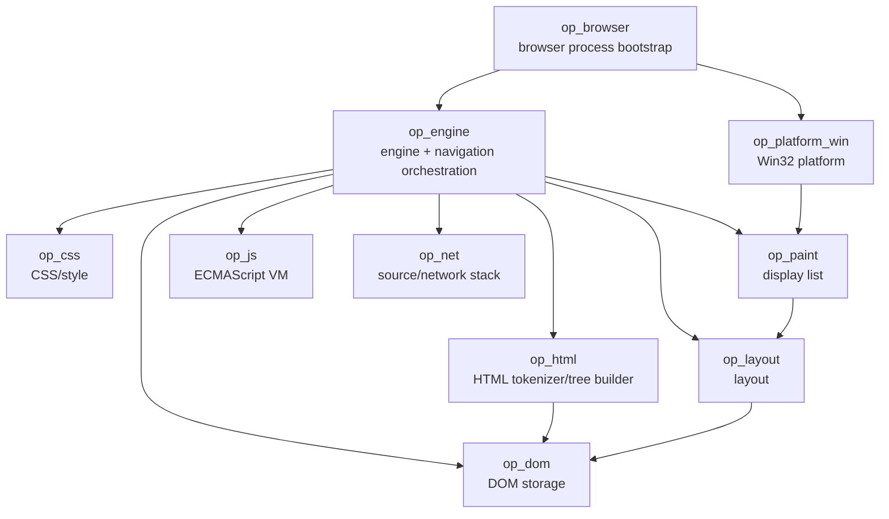
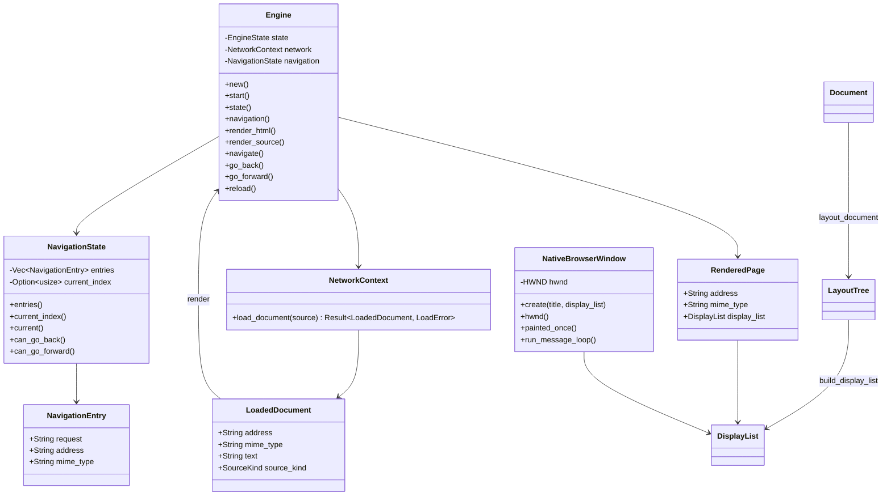

# OPBrowser Code Graph

Last updated: 2026-10-05

This document is the maintained human-readable code/dependency graph. It is updated
whenever crates, important types, or ownership boundaries change.

## Crate dependency graph

No browser engine or ready-made JavaScript engine is below this graph.

## Current key types

## Navigation invariants

- A history entry is committed only after source loading and rendering succeed.
- Back/forward reload the historical request but do not create duplicate entries.
- Reload does not mutate the history list or current index.
- Navigating from the middle of history truncates the old forward branch.
- No-target back/forward operations are no-ops.

## Current ownership boundaries

- op_browser owns process bootstrap and will own browser-level UI/session input.
- op_platform_win owns Windows-specific window/input/surface/process glue and consumes
  platform-neutral display lists.
- op_engine currently owns per-page navigation state plus orchestration between loading
  and web-engine subsystems. This state will later become per-tab.
- op_net owns document-source interpretation/loading, and later URL networking, HTTP(S),
  cache, cookies and filtering.
- op_html owns HTML tokenization and tree construction rules.
- op_dom owns document/node storage, element attributes, and DOM invariants.
- op_layout owns current text-flow geometry and will grow into full layout.
- op_paint owns platform-neutral paint commands/display lists.
- op_css will own parsing, cascade, computed style, and style data.
- op_js will own the original ECMAScript implementation.

## Temporary architectural constraints

- The initial Windows renderer uses GDI as an OS drawing backend.
- Display-list storage is currently process-global because M1 has one window.
- Navigation state is single-page/single-tab for now.
- Source navigation from the UI is not wired yet; startup navigation uses the same
  history API that the UI will call.
- Later browser/window isolation will move display-list and navigation state to
  per-window/per-tab/per-renderer ownership.

## Active graph changes

The next graph expansion will connect:

Win32 navigation events -> op_browser event loop -> Engine navigation ->
updated DisplayList -> NativeBrowserWindow repaint.
