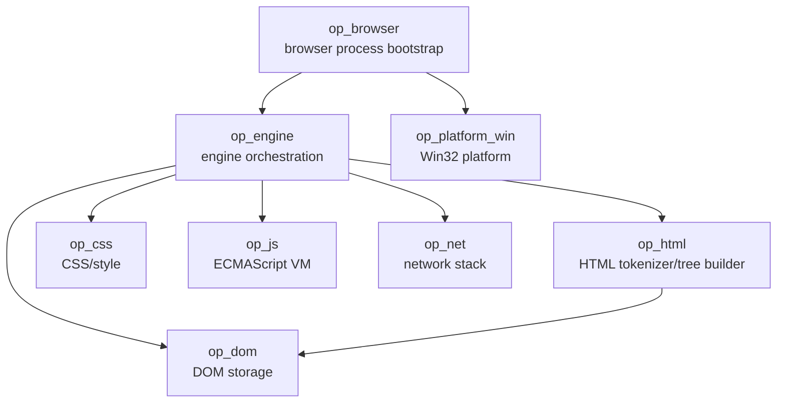
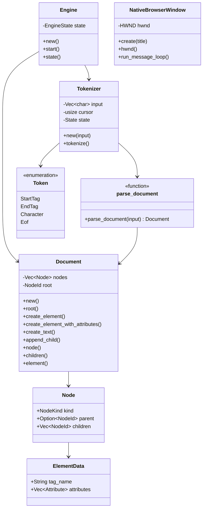

# OPBrowser Code Graph

Last updated: 2026-10-05

This document is the maintained human-readable code/dependency graph. It is updated
whenever crates, important types, or ownership boundaries change.

## Crate dependency graph

No browser engine or ready-made JavaScript engine is below this graph.

## Current key types

## Current ownership boundaries

- op_browser owns process bootstrap and eventually browser-level UI/session state.
- op_platform_win owns Windows-specific window/input/surface/process glue.
- op_engine owns orchestration between web-engine subsystems.
- op_html owns HTML tokenization and tree construction rules.
- op_dom owns document/node storage, element attributes, and DOM invariants.
- op_css will own parsing, cascade, computed style, and style data.
- op_js will own the original ECMAScript implementation.
- op_net will own navigation networking, HTTP(S), cache, cookies, and filtering.

## Active graph changes

The next graph expansion will connect:

op_dom::Document -> op_layout -> op_paint display list ->
op_platform_win paint surface.
