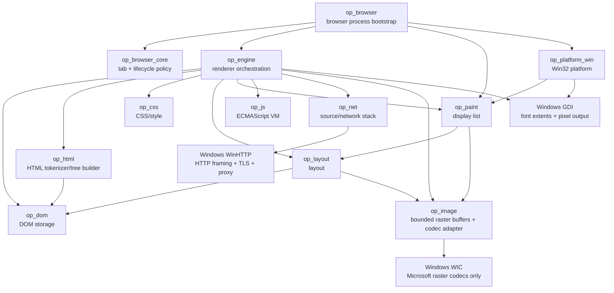

# OPBrowser Code Graph

Last updated: 2026-10-07

This document is the maintained human-readable code/dependency graph. It is updated
whenever crates, important types, or ownership boundaries change.

## Crate dependency graph



No browser engine or ready-made JavaScript engine is below this graph.

## Current key types

```mermaid
classDiagram
    class Engine {
        -EngineState state
        -NetworkContext network
        -NavigationState navigation
        -Option~String~ document_address
        -Option~PreparedDocument~ active_document
        +new()
        +start()
        +state()
        +navigation()
        +render_html()
        +set_html_page()
        +reflow()
        +render_source()
        +navigate()
        +follow_link()
        +go_back()
        +go_forward()
        +reload()
    }

    class NavigationState {
        -Vec~NavigationEntry~ entries
        -Option~usize~ current_index
        +entries()
        +current_index()
        +current()
        +can_go_back()
        +can_go_forward()
    }

    class PreparedDocument {
        address
        mime_type
        document
        images
        PageImages elements / generated
        stylesheet_addresses
        +render(width, height)
    }

    class NavigationEntry {
        +String request
        +String address
        +String mime_type
    }

    class RenderedPage {
        +String address
        +String mime_type
        +DisplayList display_list
    }

    class NetworkContext {
        -RequestFilter request_filter
        +request_filter()
        +request_filter_mut()
        +load_document(source) Result~LoadedDocument, LoadError~
        +load_stylesheet_for_page(source, top_level, limit)
        +load_image_for_page(source, top_level, limit)
    }

    class RequestFilter {
        +import_adblock_rules(text) FilterImportReport
        +check(url, resource_type, top_level) RequestDecision
        +allow_site(host)
        +stats() FilterStats
    }

    class TabManager {
        +open(address, activate) TabId
        +activate(id)
        +close(id)
        +automatic_discard_candidate() TabId
        +discard(id, reason, scroll_y)
        +finish_restore(id)
    }

    class JsRuntime {
        -heap JsObject[]
        -environments Environment[]
        -global_env EnvironmentId
        -object_prototype ObjectId
        -array_prototype ObjectId
        -error_prototype ObjectId
        -type_error_prototype ObjectId
        -reference_error_prototype ObjectId
        -global_object ObjectId
        -instruction_budget
        -object_budget
        -environment_budget
        -call_depth_budget
        +new()
        +with_instruction_budget(limit)
        +eval_script(source) JsValue
        +execute(compiled) JsValue
        +global(name) JsValue
        +get_property(target, key) JsValue
    }
    class Environment {
        parent EnvironmentId?
        kind Global / Function / Block
        bindings
    }
    class FunctionObject {
        implementation User / Builtin
    }
    class FunctionImplementation {
        User FunctionTemplate + EnvironmentId
        Builtin Error / TypeError / ReferenceError
    }
    class JsObject {
        properties
        prototype ObjectId?
        kind Ordinary / Array / Function
        function FunctionObject?
    }
    class ObjectId {
        opaque heap index
    }
    class CompiledScript {
        code Instruction[]
    }
    class FunctionTemplate {
        name
        params
        code Instruction[]
    }
    class TryTemplate {
        try_code Instruction[]
        catch_param
        catch_code Instruction[]?
        finally_code Instruction[]?
    }
    class RunOutcome {
        Complete / Returned / Thrown
        Break / Continue
    }
    class Instruction {
        Push / Load / Declare / Assign
        UpdateBinding / UpdateProperty
        CreateObject / CreateArray / CreateFunction
        GetProperty / SetProperty / Call / Construct
        Unary / Binary / Dup / Pop
        EnterScope / ExitScope / UnwindScopes
        Jump / JumpIfFalse / JumpIfTrue
        Try / Throw / BreakSignal / ContinueSignal
        Return / SetCompletion / Halt
    }

    class Encoding {
        Utf8
        Utf16Le
        Utf16Be
        Windows1251
        Windows1252
    }

    class LoadedDocument {
        +String address
        +String mime_type
        +String text
        +SourceKind source_kind
    }

    class NativeBrowserWindow {
        -HWND hwnd
        +create(title, display_list)
        +hwnd()
        +painted_once()
        +viewport_size()
        +submit_address()
        +present()
        +link_at_client_point()
        +click_first_link()
        +set_navigation_state()
        +set_status()
        +run_message_loop(on_event)
    }

    class NavigationEvent {
        Navigate(source)
        FollowLink(href)
        Back
        Forward
        Reload
        Poll
    }

    class HttpUrl {
        secure
        host
        port
        target
    }

    class Document
    class Tokenizer
    class Characters {
        first
        second
        +iter()
    }
    class NamedEntry {
        name_offset
        value_offset
        name_length
        value_length
        legacy
    }
    class CssToken {
        kind
        Url(value) / BadUrl
        start
        end
    }
    class Stylesheet {
        rules
    }
    class StyleRule {
        selectors
        declarations
    }
    class Selector {
        compounds
        combinators
        pseudo_element
        specificity
    }
    class AttributeSelector {
        name
        matcher
        value
        case_insensitive
    }
    class PseudoClass {
        root / first-child / last-child / only-child / empty / link
        first-of-type / last-of-type / only-of-type
    }
    class FunctionalSelector {
        is / where / not -> Selector[]
        nth-child / nth-last-child -> NthSelector
    }
    class NthSelector {
        expression(a,b)
        of Selector[]
        from_end
        same_type
    }
    class PseudoElement {
        Before
        After
    }
    class Declaration {
        name
        value
        important
    }
    class Specificity {
        ids
        classes
        types
    }
    class StyleMap {
        NodeId -> MatchedDeclaration[]
        (NodeId, PseudoElement) -> MatchedDeclaration[]
        +declarations_for(node)
        +declarations_for_pseudo(node,pseudo)
    }
    class MatchedDeclaration {
        style_node
        declaration
        specificity
        source_order
        source
        value_from_var
    }
    class StyleCollection {
        styles
        errors
    }
    class ComputedStyleMap {
        NodeId -> ComputedStyle
        (NodeId, PseudoElement) -> ComputedPseudoStyle
        NodeId -> CustomPropertyMap
        (NodeId, PseudoElement) -> CustomPropertyMap
        +style_for(node)
        +pseudo_style_for(node,pseudo)
        +custom_properties_for(node)
        +pseudo_custom_properties_for(node,pseudo)
    }
    class CustomPropertyMap {
        case_sensitive_name -> resolved TokenKind[]
    }
    class CustomDependencyGraph {
        sorted names
        directed edges including fallback references
        iterative finish order / reverse SCC traversal
        cyclic node mask
    }
    class ValueBudget {
        token count
        token storage bytes
        fallback depth
    }
    class ComputedPseudoStyle {
        style
        content
        items Text / Image(url,style_node)
        replaced_image sole parsed URL
        quotes
    }
    class ComputedQuotes {
        Auto / None / Pairs(open,close)
    }
    class GeneratedContext {
        counters
        quote_depth
        suppressed
    }
    class CounterContext {
        counter_name -> value_stack
        +reset(name,value)
        +set(name,value)
        +increment(name,amount)
        +current(name)
        +values(name)
    }
    class CounterOperation {
        name
        value
    }
    class Display {
        Inline / Block / FlowRoot
        Flex / InlineFlex
        Table roles / Contents / None
    }
    class ComputedStyle {
        display
        color
        font_size_px
        font_weight
        font_style
        line_height
        text_align
        white_space
        text_decoration_line
        letter_spacing_px
        word_spacing_px
        text_transform
        background_color
        margin_edges
        padding_edges
        border_edges
        width / min_width / max_width
        height / min_height / max_height
        box_sizing
    }
    class InlineBoxStyle {
        node_id
        pseudo_identity
        padding_edges
        background
        border_edges
    }
    class NamedColorEntry {
        u16 name offset
        u8 name length
        three RGB bytes
        six-byte record
    }
    class InlineBoxes {
        parent-linked arena nodes
        cached cumulative edges and depth
        iterative stack transitions
    }
    class InlineStyle {
        typography
        optional box stack index
    }
    class EmptyInline {
        InlineStyle
        no glyph payload
    }
    class InlineAtomic {
        width / height / baseline
        nested decorations / text / images / order
    }
    class InlineImage {
        used width and height
        optional Arc RasterImage
        href
        InlineStyle ancestor stack index
        optional own InlineBoxStyle
        atomic wrapping / nowrap
    }
    class BlockContent {
        Element(NodeId)
        Generated(NodeId,PseudoElement)
        ImageAlt(NodeId)
    }
    class FlowContext {
        viewport_width
        viewport_height
        current y / floats
        positioning_stack PositioningContext[]
        flow_height_stack Option<int>[]
        output vectors
    }
    class PositioningContext {
        x
        y
        width
        definite height
    }
    class BoxDecoration {
        bounds
        background
        border_top/right/bottom/left
    }
    class LayoutTree {
        box_decorations
        text_boxes
        image_boxes
        order
    }
    class LayoutItem {
        Text_index
        Image_index
    }
    class TextMeasurer {
        +measure(text, size, weight, style) TextMetrics
    }
    class TextMetrics {
        width
        ascent
        descent
    }
    class LinkSpan {
        start_byte
        end_byte
        href
    }
    class LinkRegion {
        measured_bounds
        href
    }
    class DisplayList
    class RasterImage {
        width
        height
        pixels
        +width()
        +height()
        +pixels()
    }
    class ImageBox {
        bounds
        Arc~RasterImage~ image
        href
    }

    Engine --> NavigationState
    JsRuntime --> CompiledScript : compile / execute
    JsRuntime --> Environment : owns lexical environment arena
    JsRuntime --> JsObject : owns bounded heap
    JsObject --> ObjectId : prototype reference
    JsObject --> FunctionObject : optional callable payload
    FunctionObject --> FunctionImplementation : user bytecode or builtin
    FunctionImplementation --> FunctionTemplate : owned user bytecode template
    FunctionImplementation --> Environment : captured user closure
    CompiledScript --> Instruction : ordered bytecode with patched jump/control targets
    Instruction --> TryTemplate : nested try/catch/finally bytecode
    JsRuntime --> RunOutcome : normal and abrupt completion propagation
    NavigationState --> NavigationEntry
    Engine --> NetworkContext
    NetworkContext --> LoadedDocument
    NetworkContext --> HttpUrl
    NetworkContext --> Encoding : decode_html / BOM-header-meta selection
    Engine --> RenderedPage
    LoadedDocument --> Engine : render
    Document --> EngineStyles : discover active stylesheet links
    EngineStyles --> NetworkContext : bounded stylesheet requests
    NetworkContext --> LoadedStylesheet
    LoadedStylesheet --> Encoding : decode_css / BOM-header-charset selection
    EngineStyles --> StyleCollection : linked CSS keyed by link NodeId
    Tokenizer --> Characters : consume references
    Characters --> NamedEntry : bounded prefix lookup
    Tokenizer --> Document : tree builder
    CssToken --> Stylesheet : parse_stylesheet
    Stylesheet --> StyleRule
    StyleRule --> Selector
    StyleRule --> Declaration
    Selector --> Specificity
    Selector --> FunctionalSelector : recursive functional pseudo arguments
    FunctionalSelector --> NthSelector : filtered or same-type sibling order / maximum filter specificity
    NthSelector --> Selector : strict of filters using ordinary complex selector matcher
    Selector --> PseudoElement : terminal generated target
    Document --> StyleMap : DOM-order linked/embedded collection / selector matching
    StyleMap --> MatchedDeclaration
    MatchedDeclaration --> Declaration
    MatchedDeclaration --> Specificity
    StyleCollection --> StyleMap
    StyleMap --> CustomPropertyMap : custom-property cascade / inheritance
    CustomPropertyMap --> CustomDependencyGraph : op_css::custom dependency discovery
    CustomDependencyGraph --> CustomPropertyMap : exact cycle invalidation / dependency-order resolution
    ValueBudget --> CustomPropertyMap : bounded expansion and per-target retained storage
    CustomPropertyMap --> ComputedStyleMap : retained host + pseudo snapshots
    StyleMap --> ComputedStyleMap : host + pseudo cascade / substituted value parsing
    MatchedDeclaration --> ComputedStyleMap : invalid computed var() candidate keeps priority and resolves unset
    StyleMap --> CounterOperation : counter-reset/set/increment winner parsing
    CounterOperation --> CounterContext : document-order scoped counter mutation
    Document --> CounterContext : sibling-aware nested scope traversal
    CounterContext --> ComputedPseudoStyle : counter()/counters() generated text
    GeneratedContext --> CounterContext : document-order counter ownership
    GeneratedContext --> ComputedPseudoStyle : emitted quote depth / hidden subtree exclusion
    StyleMap --> ComputedQuotes : inherited quotes winner / var substitution
    ComputedStyleMap --> ComputedQuotes : per-host retained pairs / quotes_for
    ComputedPseudoStyle --> ComputedQuotes : inherited host or pseudo-local pairs
    Document --> ComputedPseudoStyle : attr() reads originating element attributes
    ComputedStyleMap --> ComputedStyle
    ComputedStyle --> Display : resolved formatting role
    ComputedStyleMap --> ComputedPseudoStyle
    ComputedPseudoStyle --> PseudoElement : keyed generated target
    Engine --> StyleCollection : retained author style candidates/errors
    Engine --> ComputedStyleMap : retained resolved initial CSS properties
    Engine --> PreparedDocument : one retained successful page
    PreparedDocument --> Document : DOM snapshot
    PreparedDocument --> RasterImage : shared Arc image resources
    Document --> LayoutTree : flow grouping / inline lines
    Display --> LayoutTree : block / table / flex / contents formatting dispatch
    ComputedStyleMap --> LayoutTree : display/text style + line-height/alignment/white-space/decorations/spacing/transform + block/inline box geometry
    ComputedStyle --> InlineBoxStyle : resolved inline padding/background/solid borders
    ComputedPseudoStyle --> LayoutTree : generated before/after inline items
    ComputedPseudoStyle --> BlockContent : display block retained text
    Document --> BlockContent : ordinary element child traversal
    BlockContent --> BoxDecoration : shared normal-flow block geometry / empty boxes
    FlowContext --> PositioningContext : nearest positioned ancestor / viewport fallback
    PositioningContext --> BoxDecoration : relative translation and abs/fixed containing geometry
    InlineAtomic --> LayoutTree : inline-table and inline-flex atomic placement
    InlineAtomic --> BoxDecoration : nested flex/table decorations rebased into parent flow
    InlineImage --> ImageBox : only available raster payloads produce paint items
    InlineImage --> BoxDecoration : transparent failed replacements preserve CSS geometry
    ComputedPseudoStyle --> InlineBoxStyle : pseudo decoration identity + box style
    InlineBoxes --> InlineBoxStyle : one style per owned node / parent index
    NamedColorEntry --> CssColor : binary search in packed names / opaque RGB result
    InlineStyle --> InlineBoxes : one stack index per character or image
    InlineBoxes --> BoxDecoration : per-line nested fragments / outer-before-inner allocation
    ComputedPseudoStyle --> EmptyInline : decorated empty generated strings
    Document --> EmptyInline : visually empty inline with its own box decoration
    EmptyInline --> BoxDecoration : edge width / line metrics / alignment without TextBox
    LayoutTree --> BoxDecoration : block + inline backgrounds / solid borders
    BoxDecoration --> DisplayList : background + four border FillRects
    LayoutTree --> DisplayList : styled text / image paint commands
    Engine --> TextMeasurer : worker-local GDI adapter
    TextMeasurer --> TextMetrics : whole href-run extents
    LayoutTree --> TextMeasurer : injected metric interface
    LayoutTree --> LayoutItem : ordered text / image indexes
    Engine --> RasterImage : visible img resources / bounded worker decode
    LayoutTree --> ImageBox : atomic inline box / shared baseline
    ImageBox --> RasterImage : shared Arc pixels
    DisplayList --> RasterImage : Image paint commands
    NativeBrowserWindow --> RasterImage : transient DIB / AlphaBlend
    LayoutTree --> LinkSpan : TextBox links
    DisplayList --> LinkSpan : Text paint command links
    NativeBrowserWindow --> LinkRegion : GDI measurement / hit testing
    RenderedPage --> DisplayList
    NativeBrowserWindow --> DisplayList
    NativeBrowserWindow --> NavigationEvent
```

## Navigation invariants

- A history entry is committed only after source loading and rendering succeed.
- Back/forward reload the historical request but do not create duplicate entries.
- Reload does not mutate the history list or current index.
- Navigating from the middle of history truncates the old forward branch.
- No-target back/forward operations are no-ops.
- Engine.document_address follows the last successful loaded page, including
  redirects on back/forward/reload. It is separate from immutable history requests.
- Engine::follow_link resolves the href against that effective document address
  before entering the same navigate/commit-after-success path.
- Reflow borrows only the active PreparedDocument and never loads sources or changes
  history/effective address. Failed navigation leaves that snapshot unchanged.

## Current ownership boundaries

- op_browser owns the current bootstrap, UI command/result channels and one temporary
  worker-owned renderer. Only the UI thread touches HWNDs. Results carry viewport
  dimensions; stale-width pages trigger a latest-size reflow and are not presented.
  ADR-0002 fixes the target boundary as browser-process-owned product state supervising
  renderer processes, so the current worker is intentionally a migration stage.
- op_browser_core owns UI-independent tab identity, lifecycle, protection flags, retained
  restore metadata and the initial memory-pressure discard-candidate policy. The native UI
  is not connected to multiple tabs yet.
- op_platform_win owns Windows-specific window/input/surface/process glue and consumes
  platform-neutral display lists.
- op_engine currently owns per-page navigation state plus orchestration between loading
  and web-engine subsystems. This state will later become per-tab.
- Engine.active_document retains one PreparedDocument with parsed DOM, address,
  MIME type, shared image resources, author StyleCollection and ComputedStyleMap after
  successful navigation/back/forward/reload. Stateless render_source remains uncached;
  set_html_page initializes the start page.
- op_net owns document-source interpretation, initial link-reference resolution,
  an initial HTTP URL parser, owned document byte decoding, bounded HTTP(S) loading,
  response validation and errors. RequestFilter now runs before document, stylesheet and
  image loads and supports the initial host/wildcard Adblock-style subset, exceptions,
  resource types, per-site allowlisting and counters. Its private http::windows module
  uses RAII WinHTTP handles for transport/TLS/proxy/framing/decompression. Cache and
  cookies remain future work.
- op_net::encoding owns charset label resolution, Unicode/single-byte decoding
  tables and a bounded initial HTML meta prescan. HTTP/file/data loaders share it;
  unsupported labels and malformed Unicode remain typed errors.
- op_html owns HTML tokenization and tree construction rules. Its private
  comments module implements iterative comment start/body/less-than/end states and
  emits Token::Comment(String). The tree builder now creates ordered DOM Comment nodes,
  flushing adjacent text at comment boundaries without changing the open-element stack.
  Comment detection occurs only in normal tag-open context, preserving raw-text/RCDATA.
  The private declarations module emits Token::Doctype(Doctype), preserving missing/empty
  name/public/system identifiers and force_quirks with iterative recovery. Unknown <!...
  declarations use bogus comment tokens. The tree builder maps the first pre-element
  doctype to a DOM DocumentType node and ignores later/in-element doctypes. Its private
  document_mode module applies the WHATWG compatibility matrix and stores NoQuirks,
  LimitedQuirks or Quirks on op_dom::Document; missing/late doctypes select Quirks.
  TreeBuilder now owns initial, before-html, before-head, in-head, after-head, text,
  in-body, after-body and after-after-body insertion modes, automatically creates missing
  html/head/body elements, routes metadata/text-only head tokens back to the head pointer,
  merges duplicate html/body attributes and ignores the self-closing flag for ordinary
  non-void HTML elements. InBody owns normal/list-item/button scope checks, implied-end-tag
  generation, p/block/list/description/heading/button recovery and special-element boundaries
  for generic end tags; head-only tokens encountered in body are routed back through the
  stored head pointer. Body/html end tags now switch insertion modes without popping the
  recovery stack; after-body comments attach to html, after-after-body comments attach to
  Document, and delegated/trailing tokens follow the specified in-body recovery path.
  TreeBuilder also owns an ActiveFormattingEntry list with marker boundaries and retained
  start-tag attributes. Formatting starts use the Noah's Ark three-entry cap; reconstruction
  recreates stale formatting entries on the open-element stack; formatting end tags use the
  bounded adoption-agency algorithm, including furthest-block DOM reparenting and cloned
  formatting nodes. Repeated anchors/nobr recover through the same path, while applet/marquee/
  object add and clear formatting markers. Table construction adds InTable/InTableText/
  InCaption/InColumnGroup/InTableBody/InRow/InCell, table-scope cleanup, implicit tbody/tr
  insertion, cell markers and pending table-character buffering. Foster parenting uses the
  last open table to insert misnested nodes before that table; op_dom::Document::insert_before
  supplies the required sibling insertion/reparent primitive. Foreign-content/CDATA,
  template/frameset modes and CSS table layout remain later work.
  Its private
  references module consumes the full named-reference table and numeric references
  before text/attribute tokens enter the DOM. Characters carries one or two Unicode
  scalars. references::named contains a generated sorted table of eight-byte
  NamedEntry records plus packed names/deduplicated UTF-8 values (35,378 static bytes).
  Prefix range searches require no allocation and examine at most 31 input characters.
  tools/generate_html_entities.py regenerates/verifies it offline from the pinned
  WHATWG data/entities.tsv; no new crate or runtime/build dependency is involved.
  Initial raw-text/RCDATA context keeps
  references and markup from being incorrectly parsed inside script/style/title.
- op_dom owns document/node storage, mutable element attributes used by tree-construction
  merge rules, Comment nodes, DocumentTypeData (name/public/system/force-quirks),
  DocumentMode (NoQuirks/LimitedQuirks/Quirks), DOM parent/child invariants, append_child
  reparenting and insert_before for parser-required sibling placement such as foster parenting.
- op_layout owns text-flow, block-box used-value geometry, the initial table formatting context,
  structural-container traversal and UTF-8 LinkSpan ranges preserved across whitespace
  normalization and line wrapping. It resolves percent/auto/min/max/content-vs-border-box
  widths, independent border sides, block height minima/maxima and adjacent-sibling vertical
  margin collapse. Table layout consumes computed Table/TableCaption/TableColumnGroup/
  TableColumn/TableHeaderGroup/TableRowGroup/TableFooterGroup/TableRow/TableCell roles,
  collects rows across row groups, builds an occupancy grid for colspan/rowspan and computes
  per-column min/max preferences from measured cell text, images, width/min/max constraints and
  col/colgroup hints. Available width is distributed between those preferences instead of being
  split equally. Inherited border-spacing supplies separate horizontal/vertical gaps; collapse
  mode suppresses spacing and resolves cell-cell border conflicts per grid segment by choosing
  one winning edge, assigning each internal boundary to one adjacent cell so paint does not
  double it. Table cells also retain output ranges for their nested decorations/text/images so
  baseline/top/middle/bottom vertical alignment can reposition the whole cell content after final
  row/span heights are known. Baseline cells compare first-line baselines across the row. Before
  grid placement, child-side table fixup normalizes each table root into layout-only row/cell
  sources: consecutive improper table children form anonymous rows, row-group children that are
  not rows form anonymous rows, and consecutive non-cell row children form anonymous cells.
  Anonymous cells inherit the parent table/row text properties but keep initial non-inherited box
  properties; no synthetic DOM nodes are created. Normal flow also groups consecutive orphan
  table-internal siblings, ignoring only repair-transparent whitespace/comments/display:none
  separators between them, and sends that run through an anonymous block table using the exact
  same table_box/grid path as a real display:table. Captions participate in that repaired wrapper
  and orphan table-column boxes still feed declared-column width hints. Table auto sizing carries
  percentage constraints alongside content min/max preferences so percentage tracks reserve their
  share before remaining width is expanded into auto tracks. Explicit-width table-layout:fixed uses
  col/colgroup hints first, then explicit first-row cell widths, then divides remaining track space;
  later-row content does not renegotiate those fixed tracks. caption-side is inherited and the
  table wrapper now lays top captions before the table border box and bottom captions after it, so
  the table background/border no longer incorrectly contains caption geometry.
  display:inline-table uses flow::inline_table_atomic: it computes an initial shrink-to-fit width,
  runs the same table_box in a local layout Context, then packages its nested decorations/text/
  images/order into inline::InlineAtomic. Lines treats that object as one wrapping unit and carries
  the element VerticalAlign with it. Baseline uses the table first-row baseline; top/bottom anchor
  the whole atomic box to the final line box, middle centers it around the parent text middle
  approximation, and tall top/bottom atoms enlarge line descent so they are not clipped. Placement
  then offsets retained nested output into the final aligned box and remaps LayoutItem indices
  without flattening the table into fake text or pixels. Outer anchor identity is inherited by
  nested text/images when they do not already carry a link.
  Caption flow, real cell backgrounds/borders/padding and span geometry reach ordinary
  BoxDecoration/text/image output. Whitespace-only text between block siblings is suppressed before
  it can create anonymous line geometry.
  op_image::RasterImage carries IntrinsicSize separately from raster canvas dimensions. Ordinary
  raster decoders expose their natural width/height/ratio; the initial bounded SVG slice derives
  optional root width/height plus viewBox ratio and rasterizes simple rect content into the same BGRA
  resource. op_layout::replaced consumes optional intrinsic width/height/ratio for explicit/auto
  replaced sizing, CSS default object dimensions and min/max ratio conflicts. flow converts CSS
  percentage-width/font-relative/content-vs-border-box sizes and applies the existing
  available-width/4096-height fitting policy after CSS used sizes.
  flow::resolve_image_size shares this path between DOM img and sole-URL inline pseudos;
  mixed generated lists retain anonymous intrinsic image items. Pseudo image box identity
  preserves host/pseudo separation and does not duplicate inherited decorated ancestors.
  Context::block_image shares DOM/sole-URL block used sizes, separate percentage basis/fit
  width, auto margins, exact decoration bounds and collapsed vertical-margin flow without
  introducing anonymous text-line leading around a replaced block.
- op_paint owns platform-neutral paint commands/display lists, CSS color conversion and
  BoxDecoration -> FillRect expansion for backgrounds/four border sides. Computed UA link
  color/underline defaults and author overrides use ordinary text commands; LinkSpan carries
  click identity without overriding presentation. Alpha colors composite over the white page.
  TEXT_FONT_FAMILY and Windows GDI_TEXT_LOCK are shared by engine metric adapter and
  native painter. Font realization, measurement/drawing and cleanup are synchronized
  per operation; networking and original layout do not hold this gate.
  The current GDI backend measures painted glyph ranges for native hit testing;
  network addresses are resolved only by the worker/engine, not by the painter.
- op_css owns CSS tokenization/parsing, author-style matching and the initial cascade.
  It traverses op_dom, interleaves loaded link stylesheets with style elements at their
  actual DOM positions, collects inline style attributes, and matches the
  selector AST right-to-left and builds per-NodeId MatchedDeclaration candidates. Selector
  matching now includes attribute operators, adjacent/general element siblings and the
  initial structural/link pseudo-class set. compute_styles resolves supported values using
  !important, inline source,
  specificity and source order, then applies inheritance/global keywords into a
  ComputedStyleMap. Display now distinguishes inline/block/none plus table, caption, column,
  row-group, row and cell roles; the HTML UA defaults assign native table elements those roles,
  center captions, bold th cells, give td/th 1px padding, make table sizing border-box and give
  tables the 2px separate-border spacing default. Computed properties include inherited
  border-spacing and border-collapse plus non-inherited vertical-align
  (baseline/top/middle/bottom) alongside color, font-size/font-weight, background-color,
  margin/padding edges, independent border edges, width/height min/max and box-sizing.
  Box shorthand/longhand
  candidates are compared by normal cascade priority;
  length parsing covers percent, em/rem and CSS absolute units. One CssColor parser now
  handles hex/all 148 opaque named colors plus RGB/HSL/HWB for text/background/borders.
  Unquantized HSL channels feed HWB white/black mixing before final CssColor byte conversion.
  Hue units normalize in wider arithmetic before scaling, avoiding overflow for large angles.
  color(srgb)/color(srgb-linear) share modern three-channel/alpha parsing with HWB. Linear
  channels use the sRGB transfer curve before final 8-bit CssColor encoding; initial channel
  clipping/used-value none resolution do not preserve color-space metadata for interpolation.
  All modern RGB/HSL/HWB/color() functions share three-component/slash-alpha parsing. Modern
  HSL accepts numeric/percentage saturation/lightness and missing components. Legacy RGB
  requires uniform number or percentage channels; legacy HSL keeps percentage-only S/L.
  op_css::named owns allocation-free ASCII case-insensitive binary search through packed
  names and six-byte records (2,210 static bytes). Its generated named::data comes from pinned
  crates/op_css/data/named-colors.tsv; tools/generate_css_named_colors.py regenerates/checks
  it offline. Transparent/currentcolor stay special computed keywords outside the opaque table.
  UA defaults mirror M1 block/hidden tags and heading typography; heading/paragraph/list spacing is represented
  as computed margins instead of a separate layout spacing table.
- op_engine::styles walks link nodes during page preparation, applies the initial
  stylesheet-link activation subset, resolves against the effective document address,
  and owns per-document request/text budgets plus duplicate-source reuse. Load failures
  are nonfatal and successful CSS is keyed by the link NodeId for source-order collection.
- op_net::stylesheets resolves and loads bounded local/file/data/HTTP(S) CSS, blocks
  network-to-file access and HTTPS-to-HTTP downgrade, validates HTTP CSS MIME, and decodes
  BOM/transport-charset/@charset/UTF-8 before handing source text to op_css.
- op_engine::images walks computed-visible DOM and before/after content in document order.
  PageImages stores elements by NodeId and generated resources by (NodeId,pseudo,item index).
  URL sources use effective document or consuming stylesheet bases, including redirected CSS.
  Both share one worker loader/cache and candidate/request/encoded/pixel/time budgets.
  Image failure does not fail document history. Arc pixels are reused across both maps/reflow.
- op_net::images loads bounded binary HTTP/file/data image bytes; HTTP shares the
  WinHTTP transport, with image-specific Accept/byte/time limits. Source policy
  rejects network-page file access and HTTPS-to-HTTP image downgrades.
- op_image owns validated top-down premultiplied BGRA RasterImage buffers and size
  checks before pixel copying. Targeted windows bindings call explicit Microsoft
  WIC PNG/JPEG/GIF/BMP decoders, never HTML/DOM/layout/painting or a browser engine.
- op_layout places ImageBox records in normal vertical order with intrinsic or
  HTML width/height sizes, viewport fitting, inherited href and alt fallback.
- op_platform_win::raster owns transient DIB/DC lifetimes and alpha drawing; image
  rectangles enter the existing scroll-aware hit testing and clear on replacement.
- op_js owns the first executable original ECMAScript slice: lexer -> AST parser -> bytecode
  compiler -> stack VM with primitive values/global bindings plus a parse-expectation
  Test262 probe. It is not connected to <script>, DOM bindings or the page event loop yet.

## Temporary architectural constraints

- The initial Windows renderer uses GDI as an OS drawing backend.
- Display-list, scroll and measured link-region storage are currently process-global
  because M1 has one window. Display replacement clears old link regions.
- The visible product is still single-tab, but canonical tab/lifecycle/discard state now
  exists in op_browser_core so renderer/UI migration no longer needs to invent that model.
- A single in-flight navigation disables navigation buttons; the window continues
  processing paint/input/close messages. A 30 ms Win32 timer polls worker results
  only while a worker command is active and is removed on completion (no idle timer).
- WM_SIZE uses a separate 120 ms one-shot debounce timer; minimized events do not
  schedule it. Reflow presentation preserves address edits and clamps pixel scroll
  to the new page height, clears old hit regions and immediately repaints new ones.
- Win32 events are queued before calling application code, so the window procedure
  never performs networking or mutates engine history.
- HTTP URL parsing is a documented subset, not full WHATWG URL conformance.
- ADR-0002 requires browser/renderer process separation, one renderer per active tab as the
  first implementation, explicit IPC, then sandboxing and measured process sharing.

## Active graph changes

Connected: Win32 navigation events -> op_browser command channel -> worker-owned
Engine -> NetworkContext -> RequestFilter -> allow/block -> op_net/WinHTTP-or-local source
pipeline -> result channel -> UI-thread NativeBrowserWindow::present -> WM_PAINT. Also connected: painted LinkSpan -> measured
LinkRegion -> scroll-aware mouse click -> FollowLink -> resolve_link -> same worker.
Engine preparation now connects parsed DOM -> bounded external stylesheet loading ->
DOM-order linked/embedded CSS collection -> selector matching -> cascade/inheritance ->
retained ComputedStyleMap -> CSS-aware layout -> display-list text styling -> Win32 pixels.
Reflow reuses author candidates and computed values without refetching/reparsing CSS.
CSS color parsing now feeds op_css::color for Lab/LCH/OKLab/OKLCH and predefined RGB/XYZ
space conversion -> D50/D65 adaptation where required -> encoded sRGB CssColor -> existing
layout/paint commands. Background colors also retain a private ComputedColorValue expression
when they depend on `currentColor`; inheritance copies that expression and resolves the used
CssColor against the receiving element. Initial `color-mix()` supports sRGB/LCH interpolation,
and the current relative-color slice preserves or overrides channels from `currentColor` before
feeding the same 8-bit paint path.
System/deprecated color identifiers feed the same CssColor path through a deterministic
browser-owned palette. The stylesheet parser can conditionally recurse into simple declaration
`@supports` blocks. Selector matching now also resolves inherited HTML language/direction
for `:lang()`/`:dir()`, plus initial open/required/optional/link-history state pseudos.
Separately, op_js now has source -> tokenize -> AST -> bytecode -> VM as an executable
standalone language slice, and op_browser_core has tab -> lifecycle/protection -> discard
candidate -> restore-state flow ready for later UI/renderer integration.
The block-box path includes used width/min/max/auto-margin geometry, per-side borders and
adjacent sibling margin collapse before BoxDecoration/background-border FillRects. Conservative
zero-height self-collapsing subtrees now merge their entire adjoining-margin set into the pending
block margin without advancing y; the analysis may pass through whitespace-only normal text,
undecorated inline wrappers and display:contents, which lets block-in-inline collapse through an
otherwise empty parent while preserving the ordinary path for visible/boxed content. `FlowRoot` and
`FlowRootListItem` establish an initial block formatting context: the block path snapshots the outer
float set, avoids floats overlapping its start position, lays out with a local float set, extends its
natural height to contained float bottoms, then restores the outer set. Float placement keeps the
normal-flow y unchanged, while `clear` advances to the bottom of matching active floats. Floated
tables preserve their dedicated table formatter rather than degrading into generic blocks.
`Display::Contents` uses the existing child/generated-content collection path without creating a
principal box; float on a contents-only element therefore does not create a float box. Table
formatting additionally pre-expands contents wrappers only when their exposed non-ignorable
descendants are table-internal, so anonymous row/cell fixup sees the correct structure while ordinary
text/inline contents nodes remain present to carry inherited style. Flex and SVG-specific contents
behavior remains separate work. Selector matching now also recognizes `::first-letter` as a
terminal pseudo-element. Its declarations are computed as a fragment pseudo rather than generated
content; layout overlays only explicitly authored inline properties onto the first non-whitespace
Unicode grapheme cluster, using UAX #29 segmentation so Regional Indicator pairs stay atomic. This
preserves descendant/`display:contents` inherited styles for properties the pseudo did not author.
Selector matching also adds attributes, +/~ and structural pseudos before the same cascade, including filtered nth selectors
whose `of` list may begin immediately after the `of` token. `:has()` parses a strict relative-selector
list and matches forward from its anchor through descendant/child/following-sibling relations while
reusing compound matching and normal specificity. Empty-namespace `[|attr]` uses the same HTML
attribute matcher without accepting whitespace between `|` and the name.
Nested inline text/image/empty/pseudo items now retain parent-linked decoration stacks. Empty
inline elements/pseudos create an `EmptyInline` item only when padding or borders reserve actual
fragment geometry; a background alone on zero content no longer fabricates line height or splits
collapsible whitespace. Flow owns the InlineBoxes arena; each character stores one optional index,
without copying
ancestors per character. Cached cumulative edges and iterative common-ancestor transitions
participate in width fitting, wrap and alignment. Lines allocates outer decorations when
opening fragments, then fills bounds when closing, so nested opaque backgrounds paint in
containment order. Image own boxes remain atomic inside ancestor fragments; fitting reserves
ancestor edges while percentage dimensions retain the containing block width as their basis.
InlineImage separates used dimensions from optional pixels. Missing sole-URL and DOM empty/
absent-alt images use zero natural dimensions, independent CSS size axes and shared atomic/
block decorations without allocating pixels or native image hit regions. Nonempty alt uses
the styled inline formatter or BlockContent::ImageAlt normal block path. Mixed generated
failures omit anonymous images while preserving empty pseudo decorations.
Next: sliced inline decoration edges and broader computed values.

Flow synthesizes own EmptyInline items after collecting hidden/empty/collapsible-space
descendants if no visible item was produced. A block epoch counter guards against emitting
an extra empty inline fragment after a block child/pseudo flushed the collection. Nested
empty frames share arena ancestry rather than adding duplicate parent items.

## Compatibility measurement graph

The external conformance path is now explicit and versioned:

```text
compat/test262-parser-v1.txt
  -> op_js::bin::test262_probe
  -> op_js::parse_script
  -> JSON + badge metric

compat/wpt-static-v1.tsv
  -> op_browser::bin::wpt_probe
  -> Engine::render_source(test + reference)
  -> DisplayList
  -> op_platform_win::render_display_list_to_bgra
  -> shared paint_command/GDI path
  -> exact BGR pixel comparison
  -> JSON + badge metric

.github/workflows/ci.yml
  -> pinned upstream checkouts from compat/upstream.env
  -> tools/compatibility.ps1
  -> workflow artifact
  -> metrics branch on successful main push
```

`render_display_list_to_bgra` owns only an offscreen top-down DIB surface; it does not
replace layout or paint semantics. Both visible WM_PAINT and compatibility reftests call the
same `paint_command` implementation. The Test262 probe remains parser-only and does not
pretend that the current VM implements the Test262 runtime harness.
