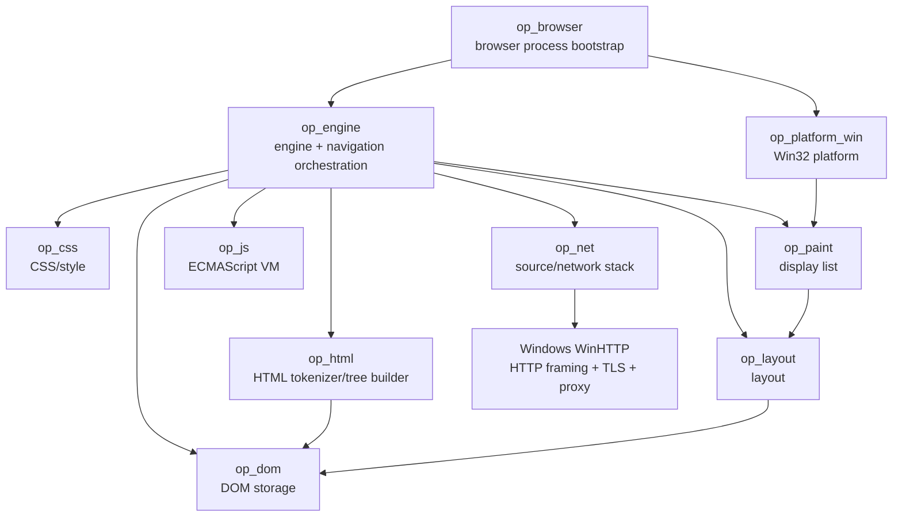
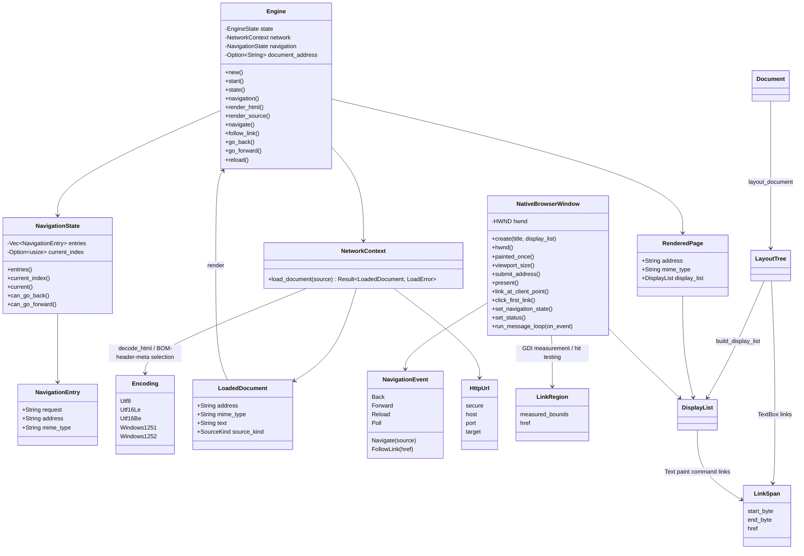

# OPBrowser Code Graph

Last updated: 2026-10-05

This document is the maintained human-readable code/dependency graph. It is updated
whenever crates, important types, or ownership boundaries change.

## Crate dependency graph

No browser engine or ready-made JavaScript engine is below this graph.

## Current key types

## Navigation invariants

- A history entry is committed only after source loading and rendering succeed.
- Back/forward reload the historical request but do not create duplicate entries.
- Reload does not mutate the history list or current index.
- Navigating from the middle of history truncates the old forward branch.
- No-target back/forward operations are no-ops.
- Engine.document_address follows the last successful loaded page, including
  redirects on back/forward/reload. It is separate from immutable history requests.
- Engine::follow_link resolves the href against that effective document address
  before entering the same navigate/commit-after-success path.

## Current ownership boundaries

- op_browser owns bootstrap, UI command/result channels and a single worker thread.
  The worker owns Engine and serializes navigation; only the UI thread touches HWNDs.
- op_platform_win owns Windows-specific window/input/surface/process glue and consumes
  platform-neutral display lists.
- op_engine currently owns per-page navigation state plus orchestration between loading
  and web-engine subsystems. This state will later become per-tab.
- op_net owns document-source interpretation, initial link-reference resolution,
  an initial HTTP URL parser, owned document byte decoding and bounded
  HTTP(S) loading, response validation and errors. Its private http::windows module
  uses RAII WinHTTP handles for transport/TLS/proxy/framing/decompression. Cache,
  cookies and request filtering remain future work.
- op_net::encoding owns charset label resolution, Unicode/single-byte decoding
  tables and a bounded initial HTML meta prescan. HTTP/file/data loaders share it;
  unsupported labels and malformed Unicode remain typed errors.
- op_html owns HTML tokenization and tree construction rules. Its private
  references module consumes a common named-reference subset and numeric references
  before text/attribute tokens enter the DOM. Initial raw-text/RCDATA context keeps
  references and markup from being incorrectly parsed inside script/style/title.
- op_dom owns document/node storage, element attributes, and DOM invariants.
- op_layout owns text-flow geometry, structural-container traversal and UTF-8
  LinkSpan ranges preserved across whitespace normalization and line wrapping.
- op_paint owns platform-neutral paint commands/display lists and default link color.
  The current GDI backend measures painted glyph ranges for native hit testing;
  network addresses are resolved only by the worker/engine, not by the painter.
- op_css will own parsing, cascade, computed style, and style data.
- op_js will own the original ECMAScript implementation.

## Temporary architectural constraints

- The initial Windows renderer uses GDI as an OS drawing backend.
- Display-list, scroll and measured link-region storage are currently process-global
  because M1 has one window. Display replacement clears old link regions.
- Navigation state is single-page/single-tab for now.
- A single in-flight navigation disables navigation buttons; the window continues
  processing paint/input/close messages. A 30 ms Win32 timer polls worker results
  only while loading and is removed when loading completes (no idle timer).
- Win32 events are queued before calling application code, so the window procedure
  never performs networking or mutates engine history.
- HTTP URL parsing is a documented subset, not full WHATWG URL conformance.
- Later browser/window isolation will move display-list and navigation state to
  per-window/per-tab/per-renderer ownership.

## Active graph changes

Connected: Win32 navigation events -> op_browser command channel -> worker-owned
Engine -> op_net/WinHTTP -> own document pipeline -> result channel -> UI-thread
NativeBrowserWindow::present -> WM_PAINT. Also connected: painted LinkSpan -> measured
LinkRegion -> scroll-aware mouse click -> FollowLink -> resolve_link -> same worker.
Next: broader HTML/URL conformance and resource loading.
