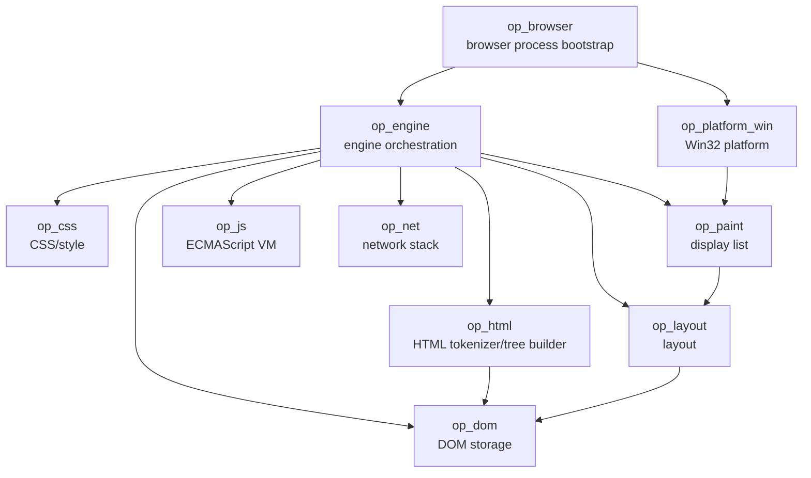
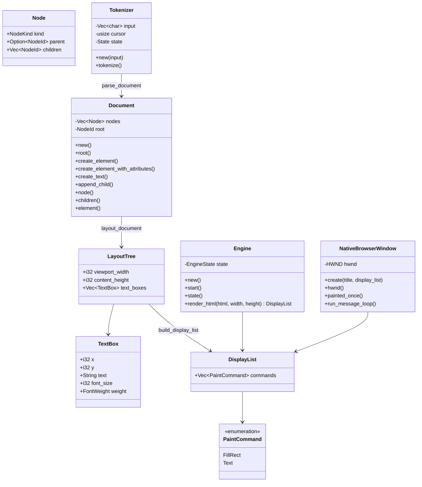

# OPBrowser Code Graph

Last updated: 2026-10-05

This document is the maintained human-readable code/dependency graph. It is updated
whenever crates, important types, or ownership boundaries change.

## Crate dependency graph

No browser engine or ready-made JavaScript engine is below this graph.

## Current key types

## Current ownership boundaries

- op_browser owns process bootstrap and eventually browser-level UI/session state.
- op_platform_win owns Windows-specific window/input/surface/process glue and consumes
  platform-neutral display lists.
- op_engine owns orchestration between web-engine subsystems.
- op_html owns HTML tokenization and tree construction rules.
- op_dom owns document/node storage, element attributes, and DOM invariants.
- op_layout owns current text-flow geometry and will grow into full layout.
- op_paint owns platform-neutral paint commands/display lists.
- op_css will own parsing, cascade, computed style, and style data.
- op_js will own the original ECMAScript implementation.
- op_net will own navigation networking, HTTP(S), cache, cookies, and filtering.

## Temporary architectural constraints

- The initial Windows renderer uses GDI as an OS drawing backend.
- Display-list storage is currently process-global because M1 has one window.
- Later browser/window isolation will move display-list state to per-window/per-renderer
  ownership and replace the temporary GDI backend with the planned DirectWrite /
  Direct2D / DirectComposition path.

## Active graph changes

The next graph expansion will connect:

navigation/local source -> op_net/source loader -> HTML input -> current rendering slice.
