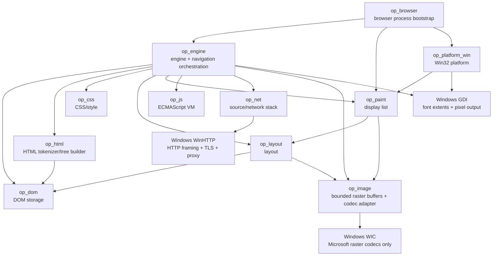

# OPBrowser Code Graph

Last updated: 2026-10-06

This document is the maintained human-readable code/dependency graph. It is updated
whenever crates, important types, or ownership boundaries change.

## Crate dependency graph



No browser engine or ready-made JavaScript engine is below this graph.

## Current key types

```mermaid
classDiagram
    class Engine {
        -EngineState state
        -NetworkContext network
        -NavigationState navigation
        -Option~String~ document_address
        -Option~PreparedDocument~ active_document
        +new()
        +start()
        +state()
        +navigation()
        +render_html()
        +set_html_page()
        +reflow()
        +render_source()
        +navigate()
        +follow_link()
        +go_back()
        +go_forward()
        +reload()
    }

    class NavigationState {
        -Vec~NavigationEntry~ entries
        -Option~usize~ current_index
        +entries()
        +current_index()
        +current()
        +can_go_back()
        +can_go_forward()
    }

    class PreparedDocument {
        address
        mime_type
        document
        images
        PageImages elements / generated
        stylesheet_addresses
        +render(width, height)
    }

    class NavigationEntry {
        +String request
        +String address
        +String mime_type
    }

    class RenderedPage {
        +String address
        +String mime_type
        +DisplayList display_list
    }

    class NetworkContext {
        +load_document(source) Result~LoadedDocument, LoadError~
    }

    class Encoding {
        Utf8
        Utf16Le
        Utf16Be
        Windows1251
        Windows1252
    }

    class LoadedDocument {
        +String address
        +String mime_type
        +String text
        +SourceKind source_kind
    }

    class NativeBrowserWindow {
        -HWND hwnd
        +create(title, display_list)
        +hwnd()
        +painted_once()
        +viewport_size()
        +submit_address()
        +present()
        +link_at_client_point()
        +click_first_link()
        +set_navigation_state()
        +set_status()
        +run_message_loop(on_event)
    }

    class NavigationEvent {
        Navigate(source)
        FollowLink(href)
        Back
        Forward
        Reload
        Poll
    }

    class HttpUrl {
        secure
        host
        port
        target
    }

    class Document
    class Tokenizer
    class Characters {
        first
        second
        +iter()
    }
    class NamedEntry {
        name_offset
        value_offset
        name_length
        value_length
        legacy
    }
    class CssToken {
        kind
        Url(value) / BadUrl
        start
        end
    }
    class Stylesheet {
        rules
    }
    class StyleRule {
        selectors
        declarations
    }
    class Selector {
        compounds
        combinators
        pseudo_element
        specificity
    }
    class AttributeSelector {
        name
        matcher
        value
        case_insensitive
    }
    class PseudoClass {
        root / first-child / last-child / only-child / empty / link
        first-of-type / last-of-type / only-of-type
    }
    class FunctionalSelector {
        is / where / not -> Selector[]
        nth-child / nth-last-child -> NthSelector
    }
    class NthSelector {
        expression(a,b)
        of Selector[]
        from_end
        same_type
    }
    class PseudoElement {
        Before
        After
    }
    class Declaration {
        name
        value
        important
    }
    class Specificity {
        ids
        classes
        types
    }
    class StyleMap {
        NodeId -> MatchedDeclaration[]
        (NodeId, PseudoElement) -> MatchedDeclaration[]
        +declarations_for(node)
        +declarations_for_pseudo(node,pseudo)
    }
    class MatchedDeclaration {
        style_node
        declaration
        specificity
        source_order
        source
        value_from_var
    }
    class StyleCollection {
        styles
        errors
    }
    class ComputedStyleMap {
        NodeId -> ComputedStyle
        (NodeId, PseudoElement) -> ComputedPseudoStyle
        NodeId -> CustomPropertyMap
        (NodeId, PseudoElement) -> CustomPropertyMap
        +style_for(node)
        +pseudo_style_for(node,pseudo)
        +custom_properties_for(node)
        +pseudo_custom_properties_for(node,pseudo)
    }
    class CustomPropertyMap {
        case_sensitive_name -> resolved TokenKind[]
    }
    class CustomDependencyGraph {
        sorted names
        directed edges including fallback references
        iterative finish order / reverse SCC traversal
        cyclic node mask
    }
    class ValueBudget {
        token count
        token storage bytes
        fallback depth
    }
    class ComputedPseudoStyle {
        style
        content
        items Text / Image(url,style_node)
        replaced_image sole parsed URL
        quotes
    }
    class ComputedQuotes {
        Auto / None / Pairs(open,close)
    }
    class GeneratedContext {
        counters
        quote_depth
        suppressed
    }
    class CounterContext {
        counter_name -> value_stack
        +reset(name,value)
        +set(name,value)
        +increment(name,amount)
        +current(name)
        +values(name)
    }
    class CounterOperation {
        name
        value
    }
    class ComputedStyle {
        display
        color
        font_size_px
        font_weight
        font_style
        line_height
        text_align
        white_space
        text_decoration_line
        letter_spacing_px
        word_spacing_px
        text_transform
        background_color
        margin_edges
        padding_edges
        border_edges
        width / min_width / max_width
        height / min_height / max_height
        box_sizing
    }
    class InlineBoxStyle {
        node_id
        pseudo_identity
        padding_edges
        background
        border_edges
    }
    class InlineBoxes {
        parent-linked arena nodes
        cached cumulative edges and depth
        iterative stack transitions
    }
    class InlineStyle {
        typography
        optional box stack index
    }
    class EmptyInline {
        InlineStyle
        no glyph payload
    }
    class InlineImage {
        used width and height
        optional Arc RasterImage
        href
        InlineStyle ancestor stack index
        optional own InlineBoxStyle
        atomic wrapping / nowrap
    }
    class BlockContent {
        Element(NodeId)
        Generated(NodeId,PseudoElement)
        ImageAlt(NodeId)
    }
    class BoxDecoration {
        bounds
        background
        border_top/right/bottom/left
    }
    class LayoutTree {
        box_decorations
        text_boxes
        image_boxes
        order
    }
    class LayoutItem {
        Text_index
        Image_index
    }
    class TextMeasurer {
        +measure(text, size, weight, style) TextMetrics
    }
    class TextMetrics {
        width
        ascent
        descent
    }
    class LinkSpan {
        start_byte
        end_byte
        href
    }
    class LinkRegion {
        measured_bounds
        href
    }
    class DisplayList
    class RasterImage {
        width
        height
        pixels
        +width()
        +height()
        +pixels()
    }
    class ImageBox {
        bounds
        Arc~RasterImage~ image
        href
    }

    Engine --> NavigationState
    NavigationState --> NavigationEntry
    Engine --> NetworkContext
    NetworkContext --> LoadedDocument
    NetworkContext --> HttpUrl
    NetworkContext --> Encoding : decode_html / BOM-header-meta selection
    Engine --> RenderedPage
    LoadedDocument --> Engine : render
    Document --> EngineStyles : discover active stylesheet links
    EngineStyles --> NetworkContext : bounded stylesheet requests
    NetworkContext --> LoadedStylesheet
    LoadedStylesheet --> Encoding : decode_css / BOM-header-charset selection
    EngineStyles --> StyleCollection : linked CSS keyed by link NodeId
    Tokenizer --> Characters : consume references
    Characters --> NamedEntry : bounded prefix lookup
    Tokenizer --> Document : tree builder
    CssToken --> Stylesheet : parse_stylesheet
    Stylesheet --> StyleRule
    StyleRule --> Selector
    StyleRule --> Declaration
    Selector --> Specificity
    Selector --> FunctionalSelector : recursive functional pseudo arguments
    FunctionalSelector --> NthSelector : filtered or same-type sibling order / maximum filter specificity
    NthSelector --> Selector : strict of filters using ordinary complex selector matcher
    Selector --> PseudoElement : terminal generated target
    Document --> StyleMap : DOM-order linked/embedded collection / selector matching
    StyleMap --> MatchedDeclaration
    MatchedDeclaration --> Declaration
    MatchedDeclaration --> Specificity
    StyleCollection --> StyleMap
    StyleMap --> CustomPropertyMap : custom-property cascade / inheritance
    CustomPropertyMap --> CustomDependencyGraph : op_css::custom dependency discovery
    CustomDependencyGraph --> CustomPropertyMap : exact cycle invalidation / dependency-order resolution
    ValueBudget --> CustomPropertyMap : bounded expansion and per-target retained storage
    CustomPropertyMap --> ComputedStyleMap : retained host + pseudo snapshots
    StyleMap --> ComputedStyleMap : host + pseudo cascade / substituted value parsing
    MatchedDeclaration --> ComputedStyleMap : invalid computed var() candidate keeps priority and resolves unset
    StyleMap --> CounterOperation : counter-reset/set/increment winner parsing
    CounterOperation --> CounterContext : document-order scoped counter mutation
    Document --> CounterContext : sibling-aware nested scope traversal
    CounterContext --> ComputedPseudoStyle : counter()/counters() generated text
    GeneratedContext --> CounterContext : document-order counter ownership
    GeneratedContext --> ComputedPseudoStyle : emitted quote depth / hidden subtree exclusion
    StyleMap --> ComputedQuotes : inherited quotes winner / var substitution
    ComputedStyleMap --> ComputedQuotes : per-host retained pairs / quotes_for
    ComputedPseudoStyle --> ComputedQuotes : inherited host or pseudo-local pairs
    Document --> ComputedPseudoStyle : attr() reads originating element attributes
    ComputedStyleMap --> ComputedStyle
    ComputedStyleMap --> ComputedPseudoStyle
    ComputedPseudoStyle --> PseudoElement : keyed generated target
    Engine --> StyleCollection : retained author style candidates/errors
    Engine --> ComputedStyleMap : retained resolved initial CSS properties
    Engine --> PreparedDocument : one retained successful page
    PreparedDocument --> Document : DOM snapshot
    PreparedDocument --> RasterImage : shared Arc image resources
    Document --> LayoutTree : flow grouping / inline lines
    ComputedStyleMap --> LayoutTree : display/text style + line-height/alignment/white-space/decorations/spacing/transform + block/inline box geometry
    ComputedStyle --> InlineBoxStyle : resolved inline padding/background/solid borders
    ComputedPseudoStyle --> LayoutTree : generated before/after inline items
    ComputedPseudoStyle --> BlockContent : display block retained text
    Document --> BlockContent : ordinary element child traversal
    BlockContent --> BoxDecoration : shared normal-flow block geometry / empty boxes
    InlineImage --> ImageBox : only available raster payloads produce paint items
    InlineImage --> BoxDecoration : transparent failed replacements preserve CSS geometry
    ComputedPseudoStyle --> InlineBoxStyle : pseudo decoration identity + box style
    InlineBoxes --> InlineBoxStyle : one style per owned node / parent index
    InlineStyle --> InlineBoxes : one stack index per character or image
    InlineBoxes --> BoxDecoration : per-line nested fragments / outer-before-inner allocation
    ComputedPseudoStyle --> EmptyInline : decorated empty generated strings
    Document --> EmptyInline : childless inline with its own box decoration
    EmptyInline --> BoxDecoration : edge width / line metrics / alignment without TextBox
    LayoutTree --> BoxDecoration : block + inline backgrounds / solid borders
    BoxDecoration --> DisplayList : background + four border FillRects
    LayoutTree --> DisplayList : styled text / image paint commands
    Engine --> TextMeasurer : worker-local GDI adapter
    TextMeasurer --> TextMetrics : whole href-run extents
    LayoutTree --> TextMeasurer : injected metric interface
    LayoutTree --> LayoutItem : ordered text / image indexes
    Engine --> RasterImage : visible img resources / bounded worker decode
    LayoutTree --> ImageBox : atomic inline box / shared baseline
    ImageBox --> RasterImage : shared Arc pixels
    DisplayList --> RasterImage : Image paint commands
    NativeBrowserWindow --> RasterImage : transient DIB / AlphaBlend
    LayoutTree --> LinkSpan : TextBox links
    DisplayList --> LinkSpan : Text paint command links
    NativeBrowserWindow --> LinkRegion : GDI measurement / hit testing
    RenderedPage --> DisplayList
    NativeBrowserWindow --> DisplayList
    NativeBrowserWindow --> NavigationEvent
```

## Navigation invariants

- A history entry is committed only after source loading and rendering succeed.
- Back/forward reload the historical request but do not create duplicate entries.
- Reload does not mutate the history list or current index.
- Navigating from the middle of history truncates the old forward branch.
- No-target back/forward operations are no-ops.
- Engine.document_address follows the last successful loaded page, including
  redirects on back/forward/reload. It is separate from immutable history requests.
- Engine::follow_link resolves the href against that effective document address
  before entering the same navigate/commit-after-success path.
- Reflow borrows only the active PreparedDocument and never loads sources or changes
  history/effective address. Failed navigation leaves that snapshot unchanged.

## Current ownership boundaries

- op_browser owns bootstrap, UI command/result channels and a single worker thread.
  The worker owns Engine and serializes navigation/reflow; only the UI thread touches
  HWNDs. Results carry viewport dimensions; stale-width pages trigger a latest-size
  reflow and are not presented. op_paint is used directly for smoke assertions.
- op_platform_win owns Windows-specific window/input/surface/process glue and consumes
  platform-neutral display lists.
- op_engine currently owns per-page navigation state plus orchestration between loading
  and web-engine subsystems. This state will later become per-tab.
- Engine.active_document retains one PreparedDocument with parsed DOM, address,
  MIME type, shared image resources, author StyleCollection and ComputedStyleMap after
  successful navigation/back/forward/reload. Stateless render_source remains uncached;
  set_html_page initializes the start page.
- op_net owns document-source interpretation, initial link-reference resolution,
  an initial HTTP URL parser, owned document byte decoding and bounded
  HTTP(S) loading, response validation and errors. Its private http::windows module
  uses RAII WinHTTP handles for transport/TLS/proxy/framing/decompression. Cache,
  cookies and request filtering remain future work.
- op_net::encoding owns charset label resolution, Unicode/single-byte decoding
  tables and a bounded initial HTML meta prescan. HTTP/file/data loaders share it;
  unsupported labels and malformed Unicode remain typed errors.
- op_html owns HTML tokenization and tree construction rules. Its private
  references module consumes the full named-reference table and numeric references
  before text/attribute tokens enter the DOM. Characters carries one or two Unicode
  scalars. references::named contains a generated sorted table of eight-byte
  NamedEntry records plus packed names/deduplicated UTF-8 values (35,378 static bytes).
  Prefix range searches require no allocation and examine at most 31 input characters.
  tools/generate_html_entities.py regenerates/verifies it offline from the pinned
  WHATWG data/entities.tsv; no new crate or runtime/build dependency is involved.
  Initial raw-text/RCDATA context keeps
  references and markup from being incorrectly parsed inside script/style/title.
- op_dom owns document/node storage, element attributes, and DOM invariants.
- op_layout owns text-flow and block-box used-value geometry, structural-container traversal
  and UTF-8 LinkSpan ranges preserved across whitespace normalization and line wrapping.
  It resolves percent/auto/min/max/content-vs-border-box widths, independent border sides,
  block height minima/maxima and adjacent-sibling vertical margin collapse. Whitespace-only
  text between block siblings is suppressed before it can create anonymous line geometry.
  op_layout::replaced resolves raster intrinsic/explicit/auto sizes and min/max ratio conflicts.
  flow converts CSS percentage-width/font-relative/content-vs-border-box sizes and applies
  the existing available-width/4096-height fitting policy after CSS used sizes.
  flow::resolve_image_size shares this path between DOM img and sole-URL inline pseudos;
  mixed generated lists retain anonymous intrinsic image items. Pseudo image box identity
  preserves host/pseudo separation and does not duplicate inherited decorated ancestors.
  Context::block_image shares DOM/sole-URL block used sizes, separate percentage basis/fit
  width, auto margins, exact decoration bounds and collapsed vertical-margin flow without
  introducing anonymous text-line leading around a replaced block.
- op_paint owns platform-neutral paint commands/display lists, CSS color conversion and
  BoxDecoration -> FillRect expansion for backgrounds/four border sides. Computed UA link
  color/underline defaults and author overrides use ordinary text commands; LinkSpan carries
  click identity without overriding presentation. Alpha colors composite over the white page.
  TEXT_FONT_FAMILY and Windows GDI_TEXT_LOCK are shared by engine metric adapter and
  native painter. Font realization, measurement/drawing and cleanup are synchronized
  per operation; networking and original layout do not hold this gate.
  The current GDI backend measures painted glyph ranges for native hit testing;
  network addresses are resolved only by the worker/engine, not by the painter.
- op_css owns CSS tokenization/parsing, author-style matching and the initial cascade.
  It traverses op_dom, interleaves loaded link stylesheets with style elements at their
  actual DOM positions, collects inline style attributes, and matches the
  selector AST right-to-left and builds per-NodeId MatchedDeclaration candidates. Selector
  matching now includes attribute operators, adjacent/general element siblings and the
  initial structural/link pseudo-class set. compute_styles resolves supported values using
  !important, inline source,
  specificity and source order, then applies inheritance/global keywords into a
  ComputedStyleMap. Properties now include display, color, font-size/font-weight,
  background-color, margin/padding edges, independent border edges, width/height min/max and
  box-sizing. Box shorthand/longhand candidates are compared by normal cascade priority;
  length parsing covers percent, em/rem and CSS absolute units. One CssColor parser now
  handles hex/basic names plus legacy/modern RGB/HSL functions for text/background/borders.
  UA defaults mirror M1 block/hidden tags and heading typography; heading/paragraph/list spacing is represented
  as computed margins instead of a separate layout spacing table.
- op_engine::styles walks link nodes during page preparation, applies the initial
  stylesheet-link activation subset, resolves against the effective document address,
  and owns per-document request/text budgets plus duplicate-source reuse. Load failures
  are nonfatal and successful CSS is keyed by the link NodeId for source-order collection.
- op_net::stylesheets resolves and loads bounded local/file/data/HTTP(S) CSS, blocks
  network-to-file access and HTTPS-to-HTTP downgrade, validates HTTP CSS MIME, and decodes
  BOM/transport-charset/@charset/UTF-8 before handing source text to op_css.
- op_engine::images walks computed-visible DOM and before/after content in document order.
  PageImages stores elements by NodeId and generated resources by (NodeId,pseudo,item index).
  URL sources use effective document or consuming stylesheet bases, including redirected CSS.
  Both share one worker loader/cache and candidate/request/encoded/pixel/time budgets.
  Image failure does not fail document history. Arc pixels are reused across both maps/reflow.
- op_net::images loads bounded binary HTTP/file/data image bytes; HTTP shares the
  WinHTTP transport, with image-specific Accept/byte/time limits. Source policy
  rejects network-page file access and HTTPS-to-HTTP image downgrades.
- op_image owns validated top-down premultiplied BGRA RasterImage buffers and size
  checks before pixel copying. Targeted windows bindings call explicit Microsoft
  WIC PNG/JPEG/GIF/BMP decoders, never HTML/DOM/layout/painting or a browser engine.
- op_layout places ImageBox records in normal vertical order with intrinsic or
  HTML width/height sizes, viewport fitting, inherited href and alt fallback.
- op_platform_win::raster owns transient DIB/DC lifetimes and alpha drawing; image
  rectangles enter the existing scroll-aware hit testing and clear on replacement.
- op_js will own the original ECMAScript implementation.

## Temporary architectural constraints

- The initial Windows renderer uses GDI as an OS drawing backend.
- Display-list, scroll and measured link-region storage are currently process-global
  because M1 has one window. Display replacement clears old link regions.
- Navigation state is single-page/single-tab for now.
- A single in-flight navigation disables navigation buttons; the window continues
  processing paint/input/close messages. A 30 ms Win32 timer polls worker results
  only while a worker command is active and is removed on completion (no idle timer).
- WM_SIZE uses a separate 120 ms one-shot debounce timer; minimized events do not
  schedule it. Reflow presentation preserves address edits and clamps pixel scroll
  to the new page height, clears old hit regions and immediately repaints new ones.
- Win32 events are queued before calling application code, so the window procedure
  never performs networking or mutates engine history.
- HTTP URL parsing is a documented subset, not full WHATWG URL conformance.
- Later browser/window isolation will move display-list and navigation state to
  per-window/per-tab/per-renderer ownership.

## Active graph changes

Connected: Win32 navigation events -> op_browser command channel -> worker-owned
Engine -> op_net/WinHTTP -> own document pipeline -> result channel -> UI-thread
NativeBrowserWindow::present -> WM_PAINT. Also connected: painted LinkSpan -> measured
LinkRegion -> scroll-aware mouse click -> FollowLink -> resolve_link -> same worker.
Engine preparation now connects parsed DOM -> bounded external stylesheet loading ->
DOM-order linked/embedded CSS collection -> selector matching -> cascade/inheritance ->
retained ComputedStyleMap -> CSS-aware layout -> display-list text styling -> Win32 pixels.
Reflow reuses author candidates and computed values without refetching/reparsing CSS.
The block-box path includes used width/min/max/auto-margin geometry, per-side borders and
adjacent sibling margin collapse before BoxDecoration/background-border FillRects. Selector
matching now adds attributes, +/~ and initial structural pseudos before the same cascade.
Nested inline text/image/empty/pseudo items now retain parent-linked decoration stacks.
Flow owns the InlineBoxes arena; each character stores one optional index, without copying
ancestors per character. Cached cumulative edges and iterative common-ancestor transitions
participate in width fitting, wrap and alignment. Lines allocates outer decorations when
opening fragments, then fills bounds when closing, so nested opaque backgrounds paint in
containment order. Image own boxes remain atomic inside ancestor fragments; fitting reserves
ancestor edges while percentage dimensions retain the containing block width as their basis.
InlineImage separates used dimensions from optional pixels. Missing sole-URL and DOM empty/
absent-alt images use zero natural dimensions, independent CSS size axes and shared atomic/
block decorations without allocating pixels or native image hit regions. Nonempty alt uses
the styled inline formatter or BlockContent::ImageAlt normal block path. Mixed generated
failures omit anonymous images while preserving empty pseudo decorations.
Next: sliced inline decoration edges and broader computed values.
