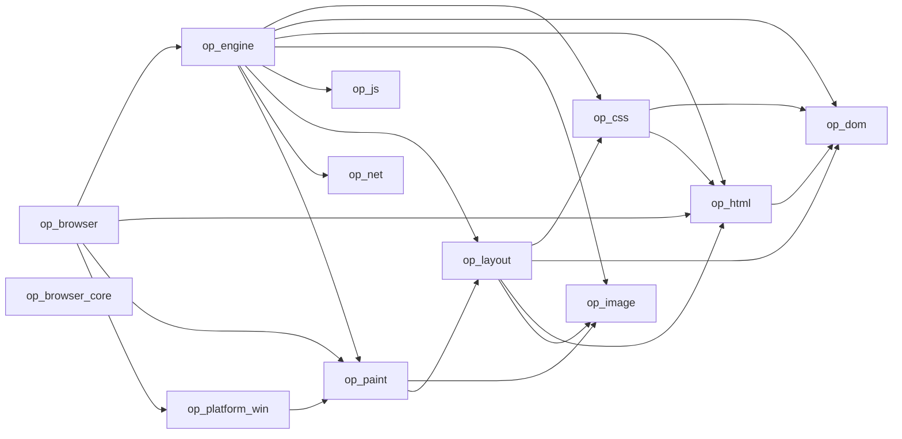

# Generated Code Graph

> Generated from Cargo manifests using `python tools/code_intelligence.py --write`.
> Edges represent local crate dependencies, not Rust function calls.

**12 crates; 22 local dependency edges.**

## Sources

- [`op_browser`](../crates/op_browser/Cargo.toml)
- [`op_browser_core`](../crates/op_browser_core/Cargo.toml)
- [`op_css`](../crates/op_css/Cargo.toml)
- [`op_dom`](../crates/op_dom/Cargo.toml)
- [`op_engine`](../crates/op_engine/Cargo.toml)
- [`op_html`](../crates/op_html/Cargo.toml)
- [`op_image`](../crates/op_image/Cargo.toml)
- [`op_js`](../crates/op_js/Cargo.toml)
- [`op_layout`](../crates/op_layout/Cargo.toml)
- [`op_net`](../crates/op_net/Cargo.toml)
- [`op_paint`](../crates/op_paint/Cargo.toml)
- [`op_platform_win`](../crates/op_platform_win/Cargo.toml)

See [CODE_GRAPH.md](CODE_GRAPH.md) for architectural decisions and runtime ownership.
